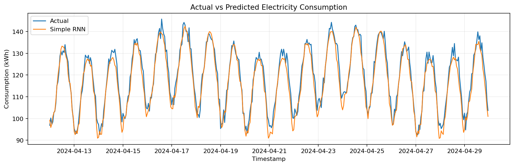
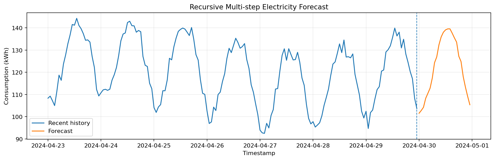
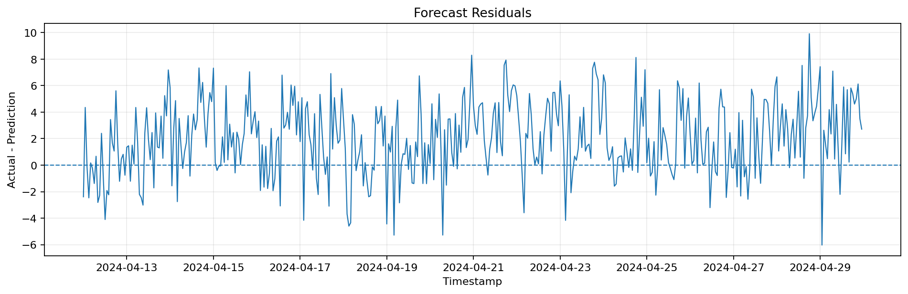
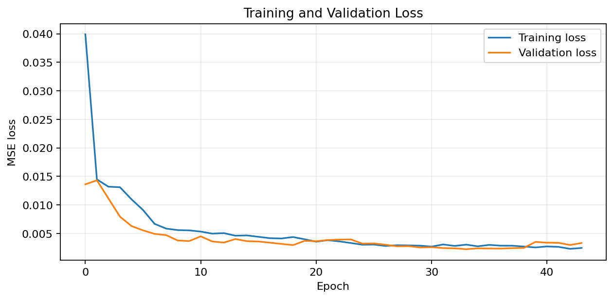
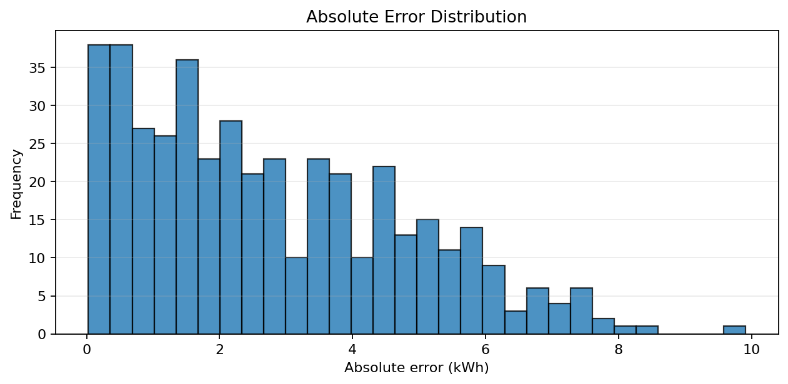
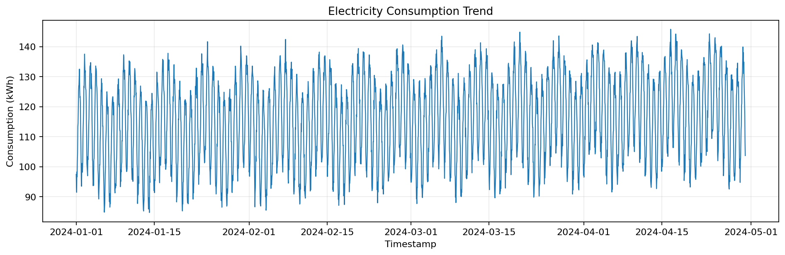
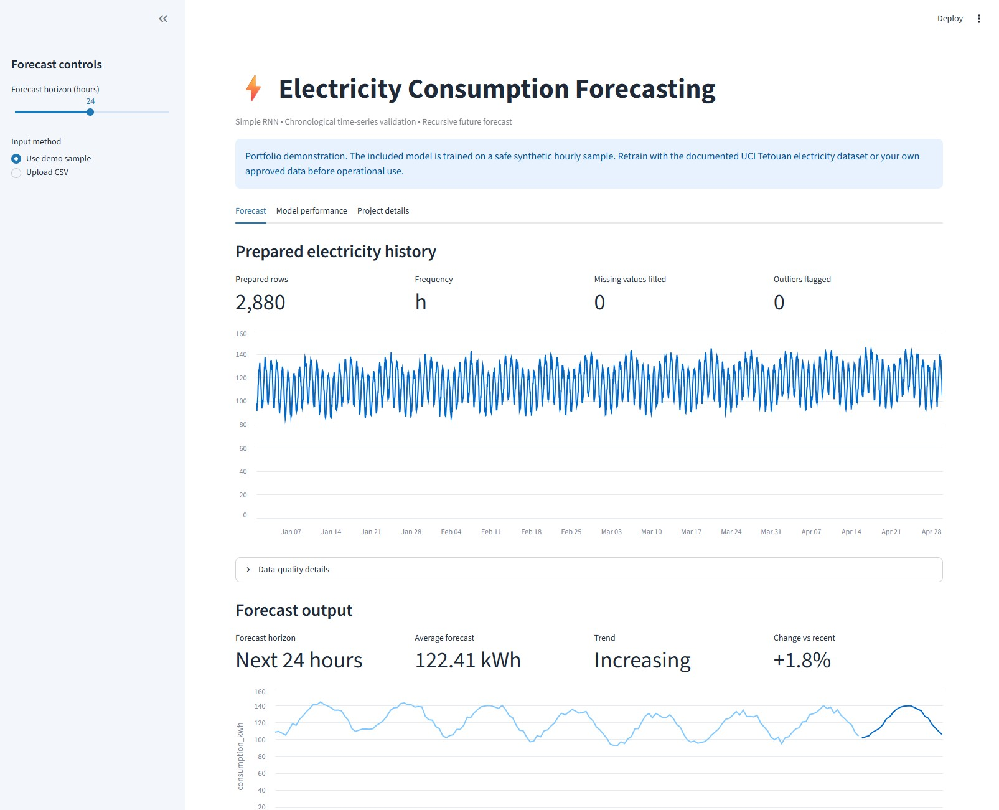
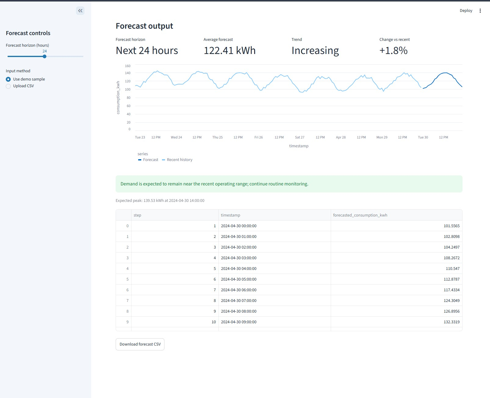
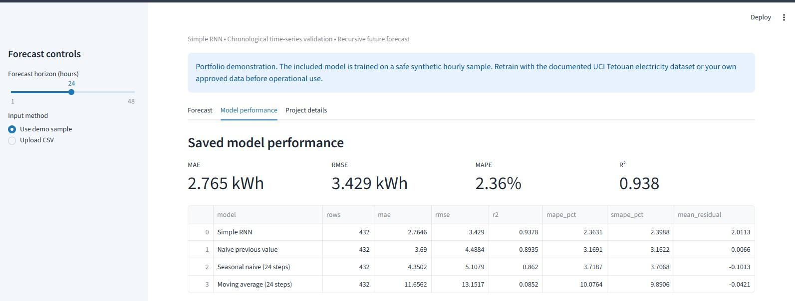
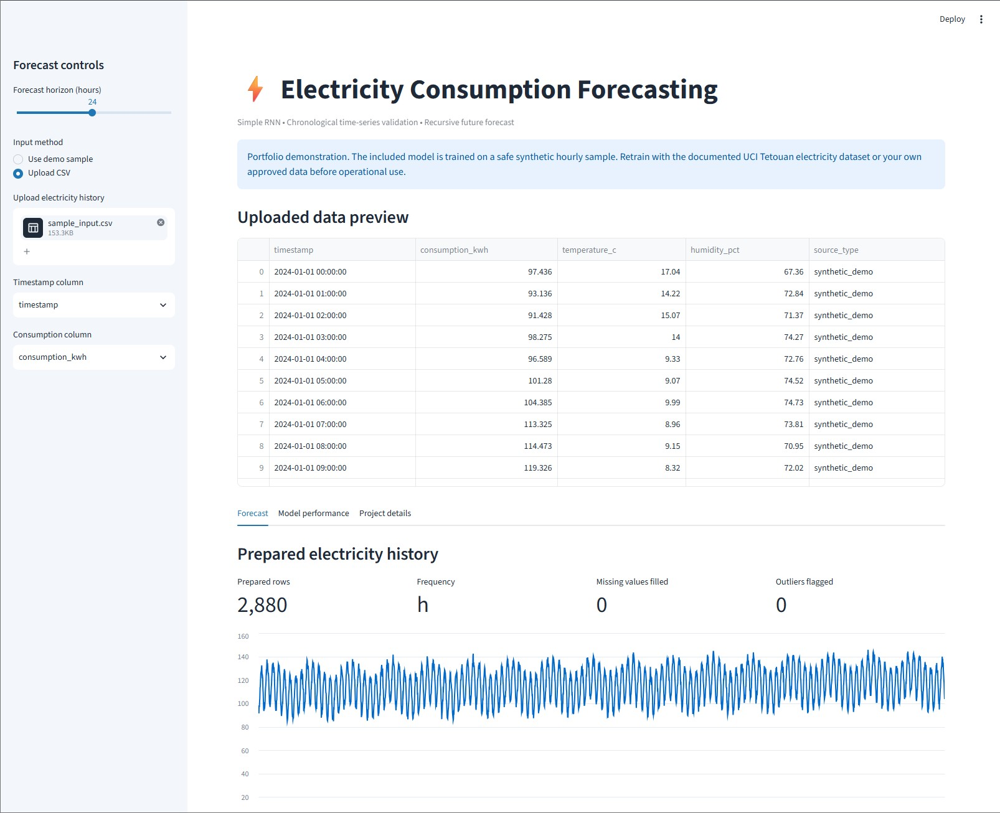

# Electricity Consumption Forecasting using a Simple RNN

[](https://www.python.org/)
[](https://www.tensorflow.org/)
[](#streamlit-demo)
[](LICENSE)
[](https://github.com/unit-mole/simple-rnn-projects/actions/workflows/electricity-rnn-ci.yml)

An end-to-end electricity-demand forecasting project that uses a trainable
**Simple Recurrent Neural Network** to learn sequential consumption patterns and
forecast near-term electricity usage. The project includes leakage-aware
time-series preprocessing, chronological validation, baseline forecasting,
saved model artifacts, residual diagnostics, recursive future forecasting, and
an interactive Streamlit application for sample and uploaded CSV data.

**Status:** Portfolio-ready · live deployment pending  
**Live demo:** Add the Streamlit URL after deployment  
**Primary stack:** Python · Keras · TensorFlow · pandas · scikit-learn · Streamlit

---

## Business Problem

Electricity demand changes by hour, day, season, and operating context.
Organizations need reliable near-term forecasts to support capacity planning,
peak-demand monitoring, maintenance scheduling, energy purchasing, and
operational decision-making.

This project answers:

> Given historical electricity-consumption data, what will near-term
> electricity demand look like?

The forecasting workflow returns:

- **Forecast horizon**
- **Forecasted electricity consumption**
- **Expected demand trend**
- **Expected peak-demand timestamp**
- **Model error metrics**
- **Operational interpretation**
- **Downloadable forecast results**

## Project Objective

Build a portfolio-ready Simple RNN solution that can:

1. Validate and prepare timestamped electricity-consumption data.
2. Sort observations chronologically and resolve duplicate timestamps.
3. Regularize the time series and fill missing target values transparently.
4. Engineer calendar features that are available at forecast time.
5. Create past-to-future sequence windows without random shuffling.
6. Fit the target scaler only on training observations.
7. Train a genuine Keras `SimpleRNN` regression model.
8. Compare the RNN with transparent forecasting baselines.
9. Evaluate performance using MAE, RMSE, MAPE, sMAPE, and R².
10. Diagnose forecast bias through residual and error analysis.
11. Generate recursive forecasts for a selectable future horizon.
12. Save and reload the model, scaler, metadata, metrics, and charts.
13. Provide an interactive Streamlit workflow for sample and uploaded data.

## Portfolio Scope

The committed sample and trained artifact are an educational portfolio
demonstration built on a deterministic **synthetic hourly electricity series**.
No private company or customer data is included.

The included outputs prove that the complete training, evaluation, persistence,
and inference workflow runs end to end. Before presenting the model as a
real-world forecasting solution, retrain it on an approved real electricity
dataset and update the documented results.

## Dataset

The repository includes:

```text
data/sample_input.csv
```

The sample contains 2,880 hourly observations with:

| Column | Description |
|---|---|
| `timestamp` | Hourly observation timestamp |
| `consumption_kwh` | Electricity-consumption target |
| `temperature_c` | Demonstration weather context |
| `humidity_pct` | Demonstration weather context |
| `source_type` | Explicit synthetic-data provenance |

The current saved RNN uses lagged consumption and known calendar variables. The
weather fields remain available for future multivariate-model extensions.

For a real-data upgrade, the project includes:

```text
scripts/download_tetouan_data.py
```

See [`data/README_data.md`](data/README_data.md) for dataset-placement,
provenance, and safety guidance.

## Tools and Technologies

| Area | Technology |
|---|---|
| Language | Python 3.12 |
| Data processing | pandas, NumPy |
| Time-series preparation | pandas chronological indexing and interpolation |
| Modeling | TensorFlow / Keras `SimpleRNN` |
| Scaling | scikit-learn `MinMaxScaler` |
| Evaluation | scikit-learn metrics and custom forecasting metrics |
| Visualization | Matplotlib and Streamlit charts |
| Model persistence | Keras `.keras`, Joblib, JSON |
| Demo application | Streamlit |
| Testing / quality | pytest, compile checks, GitHub Actions |
| Hosting | Streamlit Community Cloud |

## Project Workflow

```text
Electricity CSV or safe sample data
                │
                ▼
Schema validation and timestamp parsing
                │
                ▼
Chronological sorting and duplicate aggregation
                │
                ▼
Frequency regularization and missing-value treatment
                │
                ▼
Outlier audit and electricity-trend analysis
                │
                ▼
Calendar feature engineering
                │
                ▼
Chronological 70% / 15% / 15% split
                │
                ▼
Training-only target scaling
                │
                ▼
24-step sequence generation
                │
                ▼
Simple RNN training with shuffle disabled
                │
                ▼
Held-out evaluation and baseline comparison
                │
                ▼
Residual diagnostics and saved artifacts
                │
                ▼
Recursive future forecast and Streamlit demo
```

## Time-Series Preprocessing

The preprocessing pipeline performs the following controls:

| Control | Implementation |
|---|---|
| Timestamp parsing | Invalid timestamps are coerced and reported |
| Chronological order | Data is sorted before sequence generation |
| Duplicate timestamps | Duplicate observations are aggregated by mean |
| Missing intervals | The series is reindexed to the configured frequency |
| Missing target values | Time interpolation, then forward/backward fill |
| Invalid target values | Coerced to missing and treated through the documented fill logic |
| Outlier review | IQR-based flags are created for audit; rows are not silently removed |
| Shuffling | Disabled during RNN training |
| Leakage prevention | Scaler is fitted only on training target values |

The preprocessing output includes a structured data-quality report stored in:

```text
outputs/data_quality_report.json
```

## Chronological Split

The 2,880-row sample is divided as follows:

| Partition | Rows | Purpose |
|---|---:|---|
| Training | 2,015 | Model fitting and scaler fitting |
| Validation | 433 | Early stopping and learning-rate control |
| Test | 432 | Final untouched evaluation |

The sequence target determines partition membership. Validation and test
sequences may use earlier observations as historical context, but their target
timestamps remain inside the correct chronological partition.

## Feature Engineering

The model receives nine features at every time step:

| Feature | Purpose |
|---|---|
| `consumption_scaled` | Historical electricity-consumption signal |
| `hour_sin`, `hour_cos` | Cyclical hour-of-day representation |
| `day_of_week_sin`, `day_of_week_cos` | Cyclical weekday representation |
| `month_sin`, `month_cos` | Cyclical seasonal representation |
| `weekend_flag` | Weekend-demand indicator |
| `peak_flag` | 17:00–21:00 peak-period indicator |

Cyclical encoding prevents values such as hour 23 and hour 0 from being treated
as unrelated endpoints.

## Sequence Generation

The main supervised-learning setup is:

```text
Previous 24 hourly time steps
            ↓
Predict the next 1 hourly consumption value
```

Formally:

```text
X(t-23), X(t-22), ..., X(t)  →  y(t+1)
```

The input shape supplied to Keras is:

```text
(samples, 24 time steps, 9 features)
```

## Simple RNN Architecture

```text
Input: 24 time steps × 9 features
                ↓
SimpleRNN(64, activation="tanh")
                ↓
Dropout(0.05)
                ↓
Dense(32, activation="relu")
                ↓
Dense(1, activation="linear")
                ↓
Next-hour electricity forecast
```

Training uses:

- Adam optimizer
- Mean squared error loss
- Mean absolute error tracking
- Early stopping
- `ReduceLROnPlateau`
- `shuffle=False`
- Best-weight restoration

Simple RNN remains the primary model because this project belongs to the
Simple RNN portfolio series. GRU and LSTM comparisons are reserved for a future
benchmarking extension.

## Forecasting Approach

### Single-step model

The trained model predicts the next one-hour consumption value from the
previous 24 observations.

### Multi-hour application forecast

The Streamlit application supports a selectable **1–48 hour horizon** using
recursive forecasting:

1. Predict the next hour.
2. Append that prediction to the working sequence.
3. Generate the next timestamp and calendar features.
4. Repeat until the requested horizon is complete.

Recursive forecasting is practical for demonstration, but uncertainty and
one-step errors can accumulate as the horizon increases.

## Baseline Comparison

A recurrent model should outperform simple transparent forecasts before its
additional complexity is justified.

| Model | MAE (kWh) | RMSE (kWh) | MAPE | R² |
|---|---:|---:|---:|---:|
| **Simple RNN** | **2.765** | **3.429** | **2.36%** | **0.938** |
| Naive previous value | 3.690 | 4.488 | 3.17% | 0.893 |
| Seasonal naive — previous 24-hour value | 4.350 | 5.108 | 3.72% | 0.862 |
| Moving average — previous 24 hours | 11.656 | 13.152 | 10.08% | 0.085 |

On the included synthetic test split, the Simple RNN reduced RMSE by
approximately **23.6%** compared with the previous-value baseline.

## Model Results

| Metric | Test Result | Interpretation |
|---|---:|---|
| MAE | 2.765 kWh | Average absolute forecast miss |
| RMSE | 3.429 kWh | Error measure that penalizes large misses |
| MAPE | 2.36% | Average percentage forecast error |
| sMAPE | 2.40% | Symmetric percentage error |
| R² | 0.938 | Share of test-set variation explained |
| Mean residual | 2.011 kWh | Positive value indicates mild underprediction |

These results apply only to the committed synthetic demonstration split and
must not be represented as production performance.

## Forecast Diagnostics

### Actual vs Predicted

The held-out predictions follow the main electricity-demand pattern closely.



### Future Forecast

The saved pipeline generates a practical future-horizon output.



### Residual Analysis

Residuals help identify whether prediction errors are centered around zero and
whether errors increase during particular demand conditions.



### Training Curve

The training and validation curves support review of convergence and
overfitting.



### Error Distribution

The absolute-error distribution highlights typical and extreme forecast misses.



### Consumption Trend

The source-series trend provides context before modeling.



## Business Interpretation

The inference pipeline compares the average future forecast with the recent
24-hour average and identifies the expected peak.

Example output:

```text
Forecast Horizon: Next 24 hours
Average Forecast: 118.4 kWh
Trend: Increasing
Expected Peak: 132.7 kWh at 18:00
Business Interpretation:
Higher near-term demand is expected. Review available capacity,
peak-demand monitoring, and operational readiness.
```

Forecast error matters because:

- **Underprediction** can contribute to insufficient capacity preparation.
- **Overprediction** can contribute to unnecessary reserve allocation or cost.
- **Peak-hour error** may be more operationally important than average error.
- Long recursive horizons should be interpreted with greater caution.

## Streamlit Demo

### Application Overview

The main application view combines data-quality validation, historical
electricity patterns, forecast controls, and the initial forecast summary.



### Forecast Results and Business Interpretation

The forecast view presents the selected horizon, average expected consumption,
demand trend, change versus recent usage, expected peak, and operational
interpretation.



### Model Performance Summary

The performance dashboard reports MAE, RMSE, MAPE, R², and the comparison
between the Simple RNN and transparent forecasting baselines.



<details>
<summary><strong>View the CSV upload workflow</strong></summary>

The upload workflow allows users to select compatible timestamp and
electricity-consumption columns and generate forecasts from uploaded data.



</details>

The application supports:

- Safe preloaded sample data
- CSV upload
- Timestamp-column selection
- Consumption-column selection
- Uploaded-data preview
- Time-series quality checks
- Electricity-trend visualization
- Selectable 1–48 hour forecast horizon
- Forecast summary cards
- Expected peak and trend interpretation
- Saved-model performance table
- Actual-versus-predicted and residual charts
- Downloadable forecast CSV

### Application Entrypoint

```text
01-electricity-consumption-forecasting/app/streamlit_app.py
```

### Deployment Status

The application code and model artifacts are ready. The live URL will be added
after the repository is pushed and connected to Streamlit Community Cloud.

Add screenshots to `images/` after the local and hosted application have been
tested.

## Model Artifacts

| Artifact | Purpose |
|---|---|
| `models/electricity_rnn_model.keras` | Trained Simple RNN used by the application |
| `models/scaler.pkl` | Training-fitted target scaler |
| `models/model_metadata.json` | Input shape, feature order, split design, metrics, and provenance |
| `outputs/model_metrics.json` | Held-out Simple RNN metrics |
| `outputs/baseline_comparison.csv` | RNN and baseline comparison |
| `outputs/test_predictions.csv` | Timestamped actual values, predictions, residuals, and errors |
| `outputs/next_24_hour_forecast.csv` | Example future forecast |

## Run Locally

### 1. Open the project directory

From the `simple-rnn-projects` repository:

```bash
cd 01-electricity-consumption-forecasting
```

### 2. Create and activate a virtual environment

Windows Command Prompt:

```bat
py -3.12 -m venv .venv
.venv\Scripts\activate
```

macOS or Linux:

```bash
python3.12 -m venv .venv
source .venv/bin/activate
```

### 3. Install dependencies

```bash
python -m pip install --upgrade pip
python -m pip install -r requirements.txt
```

Install development tools when needed:

```bash
python -m pip install -r requirements-dev.txt
```

### 4. Run tests

```bash
python -m pytest -q
python -m compileall src app train_model.py
```

### 5. Launch the supplied pretrained demo

```bash
python -m streamlit run app/streamlit_app.py
```

Open the local address displayed in the terminal, normally:

```text
http://localhost:8501
```

### 6. Optional: retrain the model

Train on the included sample:

```bash
python train_model.py
```

Train on a compatible hourly CSV:

```bash
python train_model.py ^
  --data data/your_dataset.csv ^
  --timestamp-column timestamp ^
  --target-column consumption_kwh ^
  --frequency h
```

The training workflow writes the model and scaler to `models/` and evaluation
artifacts to `outputs/`.

## Deploy

The recommended hosting platform is **Streamlit Community Cloud**.

Use:

- **Repository:** `unit-mole/simple-rnn-projects`
- **Branch:** `main`
- **Entrypoint:** `01-electricity-consumption-forecasting/app/streamlit_app.py`
- **Python:** `3.12`

A deployment dependency file is included beside the app:

```text
01-electricity-consumption-forecasting/app/requirements.txt
```

See [`README_HOSTING.md`](README_HOSTING.md) for the complete deployment and
maintenance process.

## Project Structure

```text
simple-rnn-projects/
├── .github/
│   └── workflows/
│       └── electricity-rnn-ci.yml
├── 01-electricity-consumption-forecasting/
│   ├── .streamlit/
│   │   └── config.toml
│   ├── app/
│   │   ├── requirements.txt
│   │   └── streamlit_app.py
│   ├── archive/
│   │   └── original_streamlit_app.py
│   ├── data/
│   │   ├── README_data.md
│   │   └── sample_input.csv
│   ├── images/
│   │   └── README.md
│   ├── models/
│   │   ├── electricity_rnn_model.keras
│   │   ├── model_metadata.json
│   │   └── scaler.pkl
│   ├── notebooks/
│   │   ├── archive/
│   │   │   └── Code_original.ipynb
│   │   └── electricity_consumption_forecasting.ipynb
│   ├── outputs/
│   │   ├── actual_vs_predicted.png
│   │   ├── baseline_comparison.csv
│   │   ├── consumption_trend.png
│   │   ├── data_quality_report.json
│   │   ├── error_distribution.png
│   │   ├── forecast_plot.png
│   │   ├── model_metrics.json
│   │   ├── next_24_hour_forecast.csv
│   │   ├── residual_plot.png
│   │   ├── test_predictions.csv
│   │   ├── training_curve.png
│   │   └── training_history.csv
│   ├── scripts/
│   │   └── download_tetouan_data.py
│   ├── src/
│   │   ├── config.py
│   │   ├── data_preprocessing.py
│   │   ├── feature_engineering.py
│   │   ├── forecasting_pipeline.py
│   │   ├── model_evaluation.py
│   │   ├── model_training.py
│   │   ├── sequence_generation.py
│   │   └── visualization.py
│   ├── tests/
│   │   ├── conftest.py
│   │   ├── test_preprocessing.py
│   │   └── test_sequences.py
│   ├── .gitignore
│   ├── Dockerfile
│   ├── FILE_MANIFEST.csv
│   ├── LICENSE
│   ├── PROJECT_AUDIT.md
│   ├── README.md
│   ├── README_HOSTING.md
│   ├── requirements-dev.txt
│   ├── requirements.txt
│   ├── run_local.bat
│   ├── run_local.sh
│   └── train_model.py
├── 02-google-stock-price-prediction/
├── 03-imdb-data-analysis/
├── 04-sms-spam-detection/
├── 05-text-generation/
├── 06-word-embedding/
├── .gitignore
├── LICENSE
├── PROJECT_ROADMAP.md
└── README.md
```

## Testing and CI

Run lightweight tests:

```bash
python -m pytest -q
```

Check Python syntax:

```bash
python -m compileall src app train_model.py
```

The GitHub Actions workflow is located at:

```text
.github/workflows/electricity-rnn-ci.yml
```

It runs only when files related to the electricity project or its workflow are
changed.

## Original-Code Improvements

The original uploaded implementation was preserved under `archive/`, while the
portfolio version was strengthened in the following ways:

- Replaced fixed random recurrent weights plus ridge regression with a
  trainable Keras `SimpleRNN`.
- Removed the misleading treatment of a transformer oil-temperature target as
  electricity consumption.
- Added chronological train, validation, and test partitions.
- Fitted scaling only on the training target.
- Added transparent timestamp, duplicate, missing-value, and outlier handling.
- Added known-at-forecast-time calendar features.
- Added naive, seasonal-naive, and moving-average baselines.
- Added MAE, RMSE, MAPE, sMAPE, R², and residual diagnostics.
- Added reusable model persistence and forecast inference.
- Added a recruiter-friendly Streamlit application.
- Added tests, CI, hosting instructions, and a detailed project README.

See [`PROJECT_AUDIT.md`](PROJECT_AUDIT.md) for the technical audit.

## Future Improvements

- Retrain and validate on an approved real electricity-consumption dataset.
- Add forecasted weather, holidays, tariffs, and operating events.
- Add rolling-origin backtesting across multiple time folds.
- Compare Simple RNN performance with GRU, LSTM, temporal CNN, XGBoost, and
  statistical forecasting models.
- Implement direct multi-output forecasting rather than recursive prediction.
- Add prediction intervals and uncertainty calibration.
- Add peak-weighted business metrics.
- Add drift monitoring and scheduled retraining.
- Add automated model-artifact smoke tests in CI.
- Add final local and hosted Streamlit screenshots.

## Skills Demonstrated

- Time-series data validation
- Chronological model evaluation
- Data-leakage prevention
- Calendar feature engineering
- Sequence and window generation
- Simple RNN architecture design
- Regression and forecasting metrics
- Forecast-baseline benchmarking
- Residual and error analysis
- Recursive multi-step forecasting
- Keras model persistence
- Reusable inference pipelines
- Streamlit application development
- CSV upload and downloadable outputs
- Unit testing and GitHub Actions
- Deployment-ready ML project organization
- Business interpretation of demand forecasts

## Portfolio Positioning

**One-line description:** Simple RNN electricity-demand forecasting pipeline
with chronological validation, baseline benchmarking, recursive forecasts, and
an interactive Streamlit application.

**Pinned repository description:** Six-project Simple RNN portfolio featuring
time-series forecasting and NLP workflows; the first completed case study
forecasts electricity demand using leakage-aware sequence generation, Keras,
baseline comparison, residual analysis, and Streamlit deployment.

This project supports a transition from Quality Data Scientist to broader Data
Science, Machine Learning, Applied AI, Analytics Engineering, and Quality
Analytics roles by demonstrating the ability to convert sequential operational
data into a reproducible predictive workflow and decision-oriented application.

## Responsible Use

This repository is a portfolio demonstration. The included model is not
validated for production grid operations, billing, energy trading, or
safety-critical control. Forecasts should not be used for operational decisions
without real-data validation, uncertainty analysis, monitoring, and domain
review.

## Author

**Anmol Tripathi**  
Quality Data Scientist transitioning toward Data Science, Machine Learning,
Applied AI, Analytics Engineering, Business Intelligence, and Quality Analytics roles.
