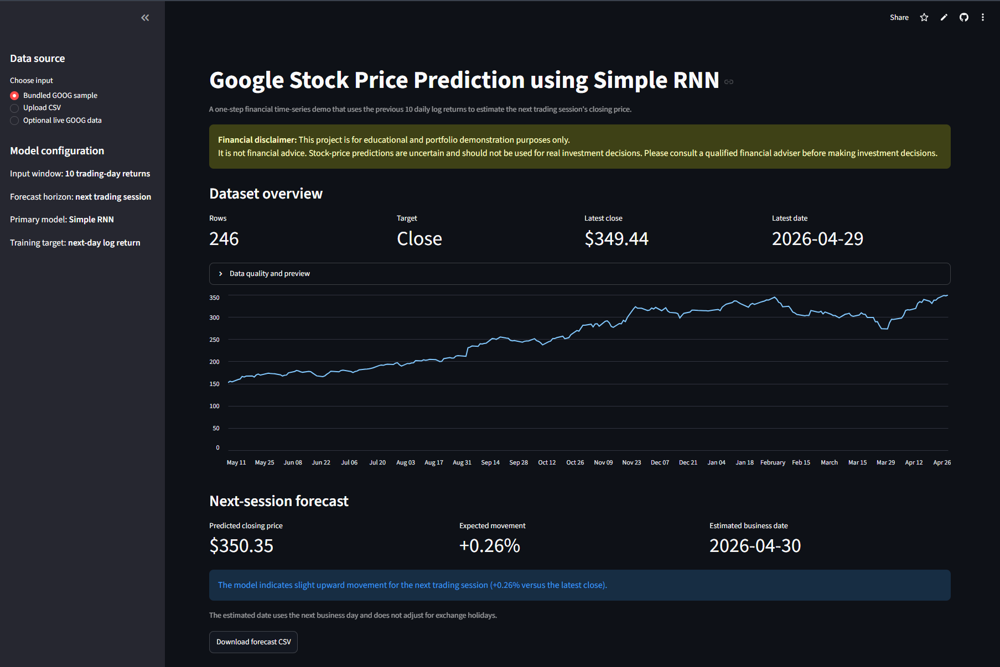
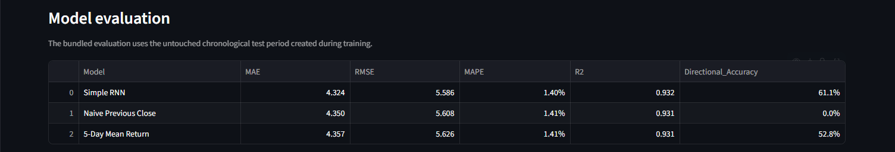
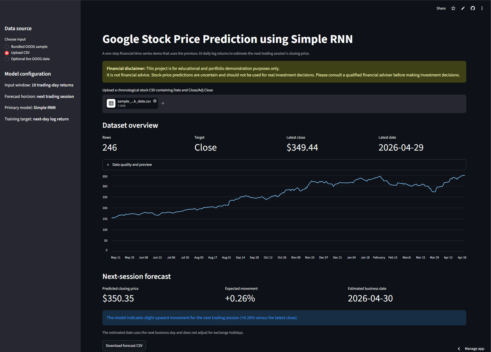
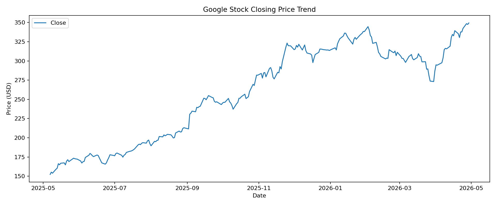
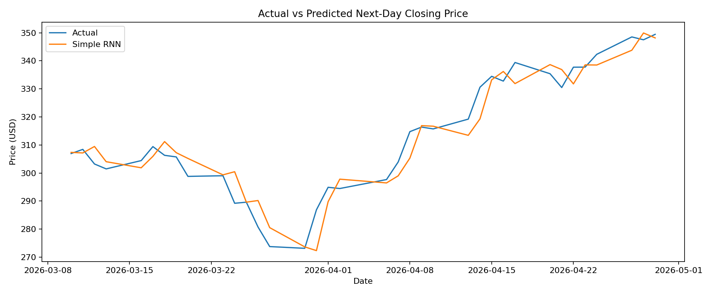
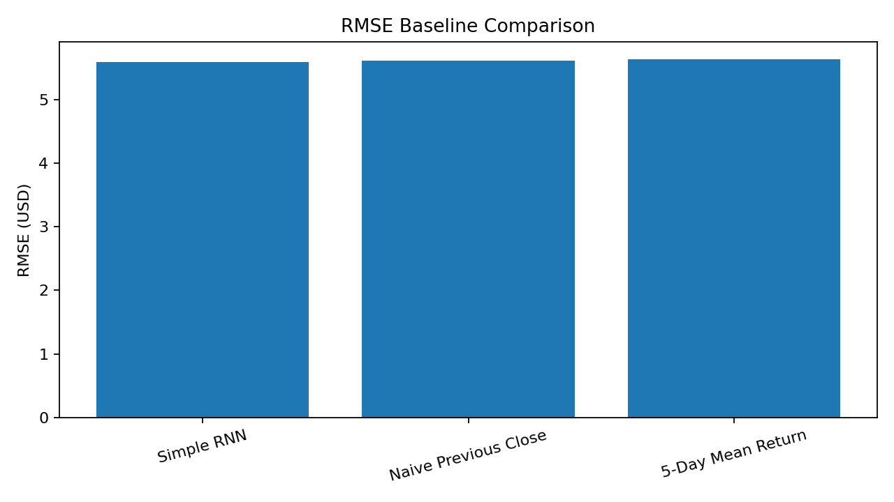
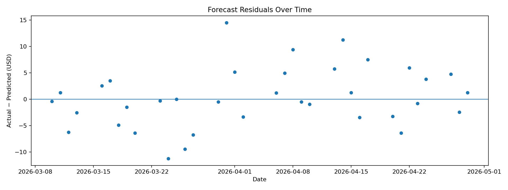
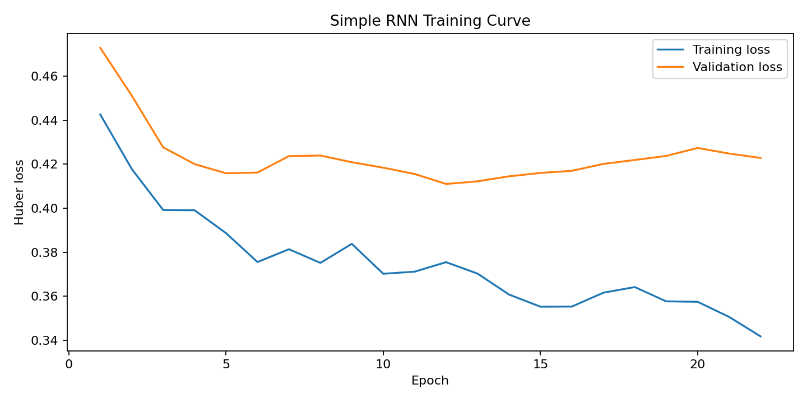
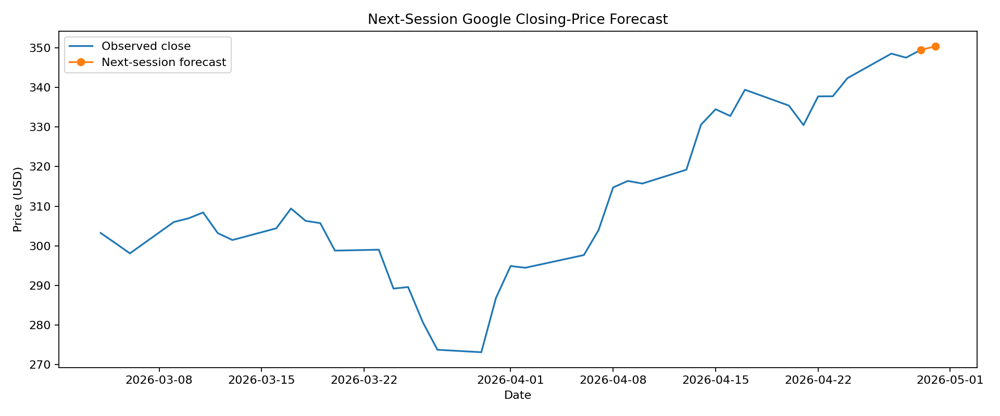

# Google Stock Price Prediction using Simple RNN

[](https://www.python.org/)
[](https://www.tensorflow.org/)
[](https://keras.io/)
[](https://simple-rnn-projects-8ppkcyb6itqkquyzd32rsk.streamlit.app/)
[](../LICENSE)
[](https://github.com/unit-mole/simple-rnn-projects/actions/workflows/google-stock-rnn-ci.yml)

An end-to-end financial time-series forecasting project that uses a **Simple Recurrent Neural Network (Simple RNN)** to estimate the next Google (`GOOG`) closing price from recent daily return behavior. The project includes leakage-controlled chronological validation, train-only scaling, baseline comparisons, saved model artifacts, residual analysis, automated testing, and an interactive Streamlit application.

**Status:** Portfolio-ready  
**Live demo:** [Open the Streamlit application](https://simple-rnn-projects-8ppkcyb6itqkquyzd32rsk.streamlit.app/)  
[](https://simple-rnn-projects-8ppkcyb6itqkquyzd32rsk.streamlit.app/)  
**Primary stack:** Python · TensorFlow · Keras · scikit-learn · pandas · Streamlit

> [!IMPORTANT]
> **Financial disclaimer:** This project is for educational and portfolio demonstration purposes only. It is not financial advice. Stock-price predictions are uncertain and should not be used for real investment decisions. Please consult a qualified financial adviser before making investment decisions.

---

## Business Problem

Financial time-series forecasting is difficult because stock prices are affected by market sentiment, macroeconomic conditions, company news, earnings, interest rates, liquidity, and many other factors that are not fully represented by historical prices alone.

This project answers:

> Given recent historical Google stock-price behavior, what closing price does a Simple RNN estimate for the next trading session?

The application produces:

- **Predicted next-session closing price**
- **Estimated percentage movement**
- **Forecast direction and interpretation**
- **Actual-versus-predicted test comparison**
- **MAE, RMSE, MAPE, R², and directional accuracy**
- **Naive and moving-return baseline comparisons**
- **Downloadable forecast and backtest outputs**

---

## Project Highlights

- Chronological train, validation, and test periods
- Train-only feature and target scaling
- Ten-trading-day input sequences
- One-session forecast horizon
- Return-based modeling to reduce raw-price extrapolation problems
- TensorFlow/Keras Simple RNN as the primary model
- Previous-close and five-day mean-return baselines
- Saved `.keras` model and reusable scalers
- Modular Python source code, notebook, tests, and CI workflow
- Streamlit app with bundled sample, CSV upload, and optional live-data modes
- Explicit financial-risk and responsible-use communication

---

## Application Preview

### 1. Application overview

The overview presents the business objective, financial disclaimer, forecasting configuration, bundled Google stock sample, historical closing-price trend, and the next-session prediction workflow.



### 2. Model performance and baseline comparison

The model-performance section reports the Simple RNN evaluation metrics and compares the neural-network forecast against the previous-close and five-day mean-return baselines.



The evaluation dashboard helps demonstrate whether the Simple RNN adds measurable value beyond simple time-series forecasting rules.

### 3. CSV upload and download workflow

Users can upload a compatible CSV file, inspect the cleaned data, generate a next-session forecast, review the backtest output, and download the generated forecast and prediction files.



---

## Project Status and Honest Scope

This is a complete, deployable portfolio project built from the supplied notebook, Streamlit prototype, real Google stock sample, and trained forecasting artifacts.

The deployed app uses a bundled GitHub-safe `GOOG` sample as its reliable default mode. Optional live data can be requested through `yfinance`, but the application does not depend on external API availability.

The model demonstrates sound time-series engineering and deployment practices. It should **not** be interpreted as an investment system, trading strategy, or evidence of guaranteed future profitability.

---

## Why the Original Implementation Needed Improvement

The supplied project correctly demonstrated a TensorFlow `SimpleRNN`, generated synthetic and real forecasts, exported reports, and included optional `yfinance` support. However, the original real-data chart showed the forecast flattening near the training price range while actual prices continued materially higher.

The original real-data output reported approximately:

| Metric | Original real-data result |
|---|---:|
| MAE | 64.61 |
| RMSE | 79.73 |
| MAPE | 21.78% |
| R² | -0.765 |
| Naive RMSE | 4.56 |

The main technical issue was asking a tanh Simple RNN trained on MinMax-scaled **raw price levels** to extrapolate beyond the price range learned during training. Additional weaknesses included a single 80/20 split, validation created inside the training block, only five default epochs, and synthetic data being positioned as the primary application flow.

### Portfolio-ready corrections

| Original approach | Updated approach |
|---|---|
| Predict scaled raw closing price | Predict next-day log return and reconstruct closing price |
| 30 raw-price observations | 10 daily log-return observations |
| 80/20 split | Chronological 70/15/15 train/validation/test split |
| Validation created inside `model.fit` | Explicit chronological validation period |
| Potential training shuffling | `shuffle=False` |
| Synthetic-first application | Real GOOG sample as the default portfolio experience |
| Model fallback could change the project type | Saved Simple RNN remains the primary deployed model |
| No saved deployable model/scalers | `.keras` model and both train-fitted scalers included |
| Weak real test performance | Honest baseline-level next-session forecasting results |

---

## Dataset

The bundled GitHub-safe sample contains **246 chronological observations**.

| Column | Meaning |
|---|---|
| `Date` | Trading date |
| `Close` | Google closing price used as the source series |

Sample period:

```text
2025-05-07 to 2026-04-29
```

The original project downloaded `GOOG` through `yfinance` and standardized the series to `Date` and `Close`; therefore, `Close` remains the default target in this version. Uploaded datasets may also contain `Adj Close`, Open, High, Low, and Volume, but the saved model currently uses the selected close-price sequence only.

See [`data/README_data.md`](data/README_data.md) for schema and data-safety guidance.

### Historical Google closing-price trend

The bundled sample preserves chronological order and shows the price regime used for the portfolio backtest and next-session demonstration forecast.



---

## Forecasting Design

### Target formulation

The model predicts the next-day log return:

```text
Next-day log return = log(next close / current close)
```

The closing-price forecast is reconstructed as:

```text
Predicted next close = current close × exp(predicted log return)
```

This formulation is more stable for a changing price level and makes the input sequence closer to stationary than raw prices.

### Input window and horizon

```text
Input: previous 10 daily log returns
Forecast horizon: next trading session
Output: predicted next-day log return → predicted next closing price
```

### Chronological split

```text
Training:   70%
Validation: 15%
Testing:    15%
```

The data is never randomly shuffled. Feature and target scalers are fit only on the training period and then applied to validation, test, and inference data.

---

## Technical Workflow

1. Load the bundled sample, uploaded CSV, or optional live `GOOG` data.
2. Parse and validate the trading-date column.
3. Sort observations chronologically and remove duplicate dates.
4. Select and clean the closing-price target.
5. Convert closing prices into daily log returns.
6. Split the data chronologically into training, validation, and test periods.
7. Fit feature and target scalers using the training period only.
8. Generate ten-trading-day input sequences.
9. Train the Simple RNN with Huber loss and early stopping.
10. Reconstruct next-session closing prices from predicted returns.
11. Compare the Simple RNN with naive forecasting baselines.
12. Evaluate error, directional performance, and residual behavior.
13. Save the model, scalers, metadata, predictions, metrics, and charts.
14. Serve the workflow through Streamlit.

---

## Simple RNN Architecture

```text
Input: (10 trading days, 1 return feature)
                ↓
SimpleRNN: 16 units, tanh
                ↓
Dropout: 0.05
                ↓
Dense: 8 units, ReLU
                ↓
Dense: 1 linear output
                ↓
Predicted scaled next-day log return
```

Training configuration:

| Setting | Value |
|---|---|
| Optimizer | Adam |
| Loss | Huber |
| Batch size | 16 |
| Maximum epochs | 80 |
| Early-stopping patience | 10 |
| Sequence shuffling | Disabled |
| Random seed | 42 |

Huber loss is used because it is less sensitive than pure MSE to unusually large daily moves while still penalizing meaningful errors.

---

## Test Results

The following results come from the untouched final chronological test period in the bundled sample:

| Model | MAE | RMSE | MAPE | R² | Directional accuracy |
|---|---:|---:|---:|---:|---:|
| **Simple RNN** | **4.324** | **5.586** | **1.40%** | **0.932** | **61.1%** |
| Naive previous close | 4.350 | 5.608 | 1.41% | 0.931 | 0.0%* |
| Five-day mean return | 4.357 | 5.626 | 1.41% | 0.931 | 52.8% |

\*The previous-close baseline always predicts zero movement, so its directional score is zero under the strict up/down comparison used here.

The Simple RNN reduces RMSE by approximately **0.40%** versus the previous-close baseline. This is a deliberately honest result: next-day stock forecasting is difficult, and a naive previous-close forecast is a strong benchmark.

### Metric interpretation

- **MAE:** average absolute closing-price error in dollars.
- **RMSE:** gives larger misses more weight than MAE.
- **MAPE:** average percentage error relative to actual closing prices.
- **R²:** describes how closely predicted price variation follows the test-period price variation.
- **Directional accuracy:** percentage of sessions where the predicted up/down direction matches the actual movement.

---

## Model Evaluation and Diagnostics

### Actual versus predicted closing price

This chart compares the Simple RNN forecast with the observed closing price across the untouched chronological test period. The close alignment reflects low price-level error, while the remaining gaps show that next-session movement remains difficult to predict precisely.



### Baseline comparison

The baseline chart compares the Simple RNN with the previous-close forecast and the five-day mean-return forecast. The small improvement over the previous-close baseline is reported transparently rather than overstated.



### Residual analysis

Residuals are calculated as `Actual Close − Predicted Close`. Values above zero indicate underprediction, while values below zero indicate overprediction. The chart helps reveal forecast bias and periods with larger errors.



### Training and validation loss

The loss curve shows how the Huber objective changed across training and validation epochs. Early stopping retains the model state with the strongest validation performance.



---

## Demonstration Forecast

```text
Latest bundled close:      $349.44
Predicted next close:      $350.35
Estimated movement:        +0.26%
Forecast horizon:          Next trading session
```

This historical demonstration output is not a current market prediction and is not financial advice.

### Next-session forecast visualization

The final observed closing prices are shown together with the reconstructed next-session Simple RNN forecast.



---

## Saved Outputs

| File | Purpose |
|---|---|
| `outputs/stock_price_trend.png` | Historical closing-price trend |
| `outputs/actual_vs_predicted.png` | Test-period actual versus Simple RNN prediction |
| `outputs/forecast_plot.png` | Latest observed prices plus the next-session forecast |
| `outputs/baseline_comparison.png` | RMSE comparison across the RNN and baselines |
| `outputs/residual_plot.png` | Residual behavior over time |
| `outputs/training_curve.png` | Training and validation Huber loss |
| `outputs/model_metrics.json` | Test metrics |
| `outputs/model_comparison.csv` | Baseline comparison table |
| `outputs/test_predictions.csv` | Detailed test-period predictions |
| `outputs/next_day_forecast.json` | Demonstration next-session forecast |
| `models/google_stock_rnn_model.keras` | Saved Keras model |
| `models/feature_scaler.joblib` | Training-fitted return scaler |
| `models/target_scaler.joblib` | Training-fitted target-return scaler |
| `models/model_metadata.json` | Architecture, split, target, and run metadata |

---

## Streamlit Application

The application supports:

- Bundled `GOOG` sample for reliable offline demonstration
- Compatible CSV upload
- Optional live `GOOG` data through `yfinance`
- Cleaned-data preview and quality report
- Historical closing-price chart
- Fixed ten-day return window and next-session forecast horizon
- Predicted closing price and expected percentage movement
- Baseline comparison table
- Actual-versus-predicted and residual charts
- Forecast and backtest downloads
- Financial disclaimers at the top and bottom of the interface

---

## Project Structure

```text
simple-rnn-projects/
├── .github/
│   └── workflows/
│       └── google-stock-rnn-ci.yml
│
└── 02-google-stock-price-prediction/
    ├── app/
    │   ├── streamlit_app.py
    │   └── requirements.txt
    ├── data/
    │   ├── README_data.md
    │   └── sample_google_stock_data.csv
    ├── images/
    │   ├── README.md
    │   ├── 01_streamlit_application_overview.png
    │   ├── 03_model_performance_and_baseline_comparison.png
    │   └── 04_csv_upload_and_download_workflow.png
    ├── notebooks/
    │   └── google_stock_price_prediction.ipynb
    ├── src/
    │   ├── __init__.py
    │   ├── config.py
    │   ├── data_preprocessing.py
    │   ├── feature_engineering.py
    │   ├── sequence_generation.py
    │   ├── model_training.py
    │   ├── model_evaluation.py
    │   ├── forecasting_pipeline.py
    │   └── visualization.py
    ├── models/
    │   ├── google_stock_rnn_model.keras
    │   ├── feature_scaler.joblib
    │   ├── target_scaler.joblib
    │   └── model_metadata.json
    ├── outputs/
    │   ├── stock_price_trend.png
    │   ├── actual_vs_predicted.png
    │   ├── forecast_plot.png
    │   ├── baseline_comparison.png
    │   ├── residual_plot.png
    │   ├── training_curve.png
    │   ├── training_history.csv
    │   ├── test_predictions.csv
    │   ├── model_comparison.csv
    │   ├── model_metrics.json
    │   └── next_day_forecast.json
    ├── tests/
    │   ├── test_data_preprocessing.py
    │   ├── test_sequence_generation.py
    │   └── test_model_evaluation.py
    ├── .gitignore
    ├── .python-version
    ├── README.md
    ├── README_HOSTING.md
    ├── requirements.txt
    └── train_model.py
```

---

## Run Locally

Use Python 3.12 to match the tested local and deployment environments.

### Windows Command Prompt

Open the repository and enter the project folder:

```bat
set "PATH=%USERPROFILE%\Tools\PortableGit\cmd;%PATH%"

cd /d "%USERPROFILE%\OneDrive - Veralto\Desktop\AI Codes\GIT Projects\simple-rnn-projects\02-google-stock-price-prediction"
```

Create and activate a virtual environment:

```bat
python -m venv "%USERPROFILE%\venvs\simple-rnn-google-stock"

call "%USERPROFILE%\venvs\simple-rnn-google-stock\Scripts\activate.bat"
```

Install the dependencies:

```bat
python -m pip install --upgrade pip setuptools wheel

python -m pip install -r requirements.txt
```

Run the automated tests:

```bat
python -m pytest -q
```

Launch the Streamlit application:

```bat
python -m streamlit run app\streamlit_app.py
```

Open the local URL displayed by Streamlit, normally:

```text
http://localhost:8501
```

### Future local runs

```bat
cd /d "%USERPROFILE%\OneDrive - Veralto\Desktop\AI Codes\GIT Projects\simple-rnn-projects\02-google-stock-price-prediction"

call "%USERPROFILE%\venvs\simple-rnn-google-stock\Scripts\activate.bat"

python -m streamlit run app\streamlit_app.py
```

---

## Optional Retraining

The included model runs without retraining.

Retrain using the bundled sample:

```bat
python train_model.py
```

Retrain using another compatible CSV:

```bat
python train_model.py --data "data\your_google_stock_data.csv" --target "Close" --window 10
```

Retraining updates the saved model, scalers, metadata, metrics, predictions, and generated charts.

---

## Deployment

The application is deployed on Streamlit Community Cloud and connected directly to the `main` branch of this GitHub repository.

**Live application:**  
[Open the Google Stock Price Prediction application](https://simple-rnn-projects-8ppkcyb6itqkquyzd32rsk.streamlit.app/)

**Streamlit entry point:**

```text
02-google-stock-price-prediction/app/streamlit_app.py
```

**Deployment configuration:**

```text
Repository: unit-mole/simple-rnn-projects
Branch: main
Python: 3.12
```

Changes pushed to the relevant project files on the `main` branch automatically trigger a Streamlit application update.

See [README_HOSTING.md](README_HOSTING.md) for deployment configuration, maintenance instructions, and troubleshooting guidance.

---

## Data and Repository Safety

- Only a small GitHub-safe Google stock sample is included.
- Optional live data is requested at runtime and is not committed to the repository.
- Virtual environments, temporary files, local logs, generated run folders, and secrets are excluded through `.gitignore`.
- Streamlit secrets must never be committed to GitHub.
- The saved model and scaler artifacts under `models/` are required for inference and should remain in the repository.
- Uploaded CSV files are processed during the application session and are not intended for permanent storage.

---

## Known Limitations

- Historical prices alone do not capture news, earnings, interest rates, macroeconomic conditions, sentiment, or market microstructure.
- The bundled sample is small and intentionally GitHub-safe.
- The model produces a one-session point forecast rather than a calibrated probability distribution.
- The estimated next date uses a business-day offset and does not account for exchange holidays.
- Baseline-level improvement should not be interpreted as evidence of a profitable trading strategy.
- Live `yfinance` access may occasionally fail because of internet, rate-limit, or upstream-service conditions.
- The model was trained on `GOOG` closing-price returns and should not be assumed to generalize to unrelated assets.

---

## Future Improvements

- Train on a longer historical period with rolling-origin backtesting
- Add adjusted close, volume, volatility, and OHLC-derived features
- Compare Simple RNN with LSTM, GRU, temporal convolution, and gradient-boosting baselines
- Add prediction intervals using quantile loss, bootstrap methods, or conformal forecasting
- Add walk-forward retraining instead of a single fixed split
- Evaluate transaction costs and economic value separately from forecast error
- Add holiday-aware exchange calendars
- Monitor data and return-distribution drift after deployment

---

## Skills Demonstrated

`Financial Time-Series Forecasting` · `Simple RNN` · `TensorFlow` · `Keras` · `Log-Return Transformation` · `Chronological Validation` · `Leakage Prevention` · `Feature Scaling` · `Sequence Generation` · `Baseline Forecasting` · `Regression Evaluation` · `Directional Accuracy` · `Residual Analysis` · `Model Serialization` · `Streamlit` · `Testing` · `CI/CD` · `Responsible AI Communication`

---

## Portfolio Description

**One-line description**

> Built and deployed a leakage-controlled Simple RNN that converts recent Google stock returns into a next-session closing-price forecast and benchmarks performance against naive time-series baselines.

**Pinned-repository description**

> End-to-end Google stock forecasting project featuring return-based Simple RNN modeling, chronological validation, baseline comparison, saved artifacts, automated testing, CI/CD, and an interactive Streamlit demo.

**Resume bullet**

> Developed a modular financial time-series forecasting pipeline using a Keras Simple RNN, chronological train/validation/test splitting, train-only scaling, baseline evaluation, residual diagnostics, model persistence, and Streamlit deployment.

---

## Career Positioning

This project supports a transition from Quality Data Scientist work into broader Data Science, Machine Learning, and Applied AI roles by demonstrating the ability to:

- diagnose a technically weak first model rather than presenting misleading results;
- redesign the forecasting target based on time-series behavior;
- build reusable preprocessing, training, evaluation, and inference modules;
- compare a neural network honestly against simple baselines;
- communicate model uncertainty and financial risk responsibly; and
- convert experimentation into a tested, deployable portfolio application.

---

## Responsible Use

This repository is a learning and portfolio artifact. It does not recommend buying, selling, or holding any security. Forecast error metrics do not establish profitability, and past price behavior does not guarantee future performance.

---

## Author

**Anmol Tripathi**  
Quality Data Scientist | Data Science | Machine Learning | Applied AI | Analytics  
GitHub: [`unit-mole`](https://github.com/unit-mole)
