# IMDb Movie Review Sentiment Analysis using Simple RNN

[](https://www.python.org/)
[](https://www.tensorflow.org/)
[](https://keras.io/)
[](https://simple-rnn-projects-ljp2wrybnrz4eheng2xsd8.streamlit.app/)
[](../LICENSE)
[](https://github.com/unit-mole/simple-rnn-projects/actions/workflows/imdb-simple-rnn-ci.yml)

An end-to-end Natural Language Processing project that uses an **Embedding layer and
Simple Recurrent Neural Network** to classify IMDb movie reviews as positive or negative.
The project includes consistent text preprocessing, chunked sequence modeling, a
validation-selected decision threshold, an untouched test set, a strong TF-IDF baseline,
error analysis, saved model artifacts, automated tests, and an interactive Streamlit app.

**Status:** Portfolio-ready  
**Live demo:** [Open the Streamlit application](https://simple-rnn-projects-ljp2wrybnrz4eheng2xsd8.streamlit.app/)  
[](https://simple-rnn-projects-ljp2wrybnrz4eheng2xsd8.streamlit.app/)  
**Primary stack:** Python · TensorFlow/Keras · scikit-learn · pandas · Streamlit

---

## Business Problem

Organizations frequently need to convert large volumes of unstructured feedback into
structured sentiment signals. Manual review is slow, inconsistent, and difficult to scale.

This project answers:

> Given an IMDb movie review, can a Simple RNN classify its sentiment as positive or negative and provide a probability-based confidence score?

The application produces:

- **Predicted sentiment**
- **Positive-sentiment probability**
- **Predicted-class confidence**
- **Confidence band**
- **Processed-review preview**
- **Batch sentiment distribution**
- **Downloadable scored CSV**

---

## Project Highlights

- Real IMDb positive/negative review classification
- Lowercasing, HTML cleanup, whitespace normalization, and OOV handling
- Vocabulary limited to 10,000 tokens
- Long-review handling through overlapping 80-token chunks
- Embedding → SimpleRNN → Dense binary classifier
- Review-level train/validation split with untouched test data
- Validation-selected probability threshold of **0.43**
- Accuracy, precision, recall, F1, specificity, ROC-AUC, PR-AUC, and MCC
- TF-IDF + Logistic Regression and majority-class baselines
- Confusion matrix, ROC, precision–recall, training, EDA, and error-analysis outputs
- Manual review, bundled sample, and CSV batch workflows in Streamlit
- Saved `.keras` model and JSON tokenizer
- Modular source package, notebook, tests, and GitHub Actions CI

---

## Application Preview

### 1. Application overview

The overview presents the NLP objective, model scope, supported workflows, 80-token sequence-chunk configuration, and validation-selected sentiment threshold.

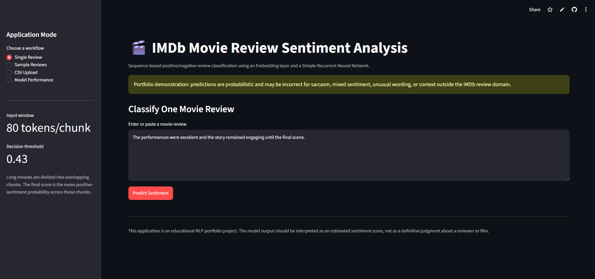

### 2. Single-review sentiment prediction

Users can type or paste an individual movie review and generate a probability-based positive or negative sentiment prediction.

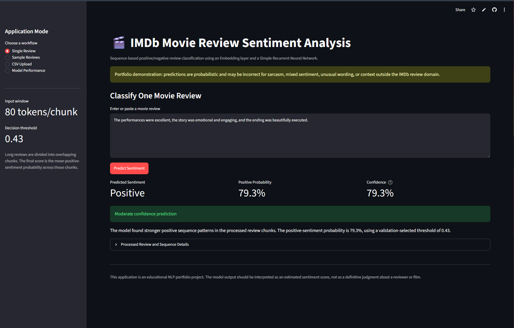

The result includes:

- predicted sentiment;
- positive-sentiment probability;
- predicted-class confidence;
- confidence band;
- interpretation text; and
- processed-review and sequence details.

### 3. Batch sentiment workflow

Users can evaluate the included privacy-safe sample reviews or upload a compatible CSV file for batch classification.

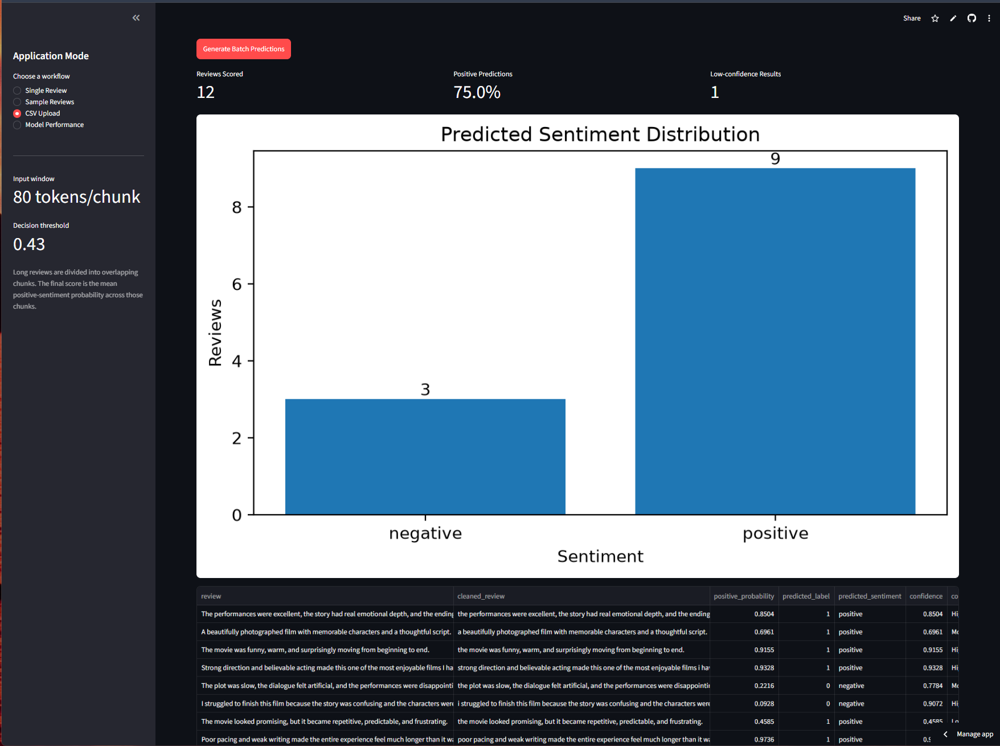

The application summarizes the number of reviews scored, predicted sentiment distribution, low-confidence results, and provides a downloadable scored CSV file.

### 4. Model-performance and error-analysis dashboard

The performance section reports held-out classification metrics, compares the Simple RNN with majority and TF-IDF logistic-regression baselines, and presents model-diagnostic charts and selected classification errors.

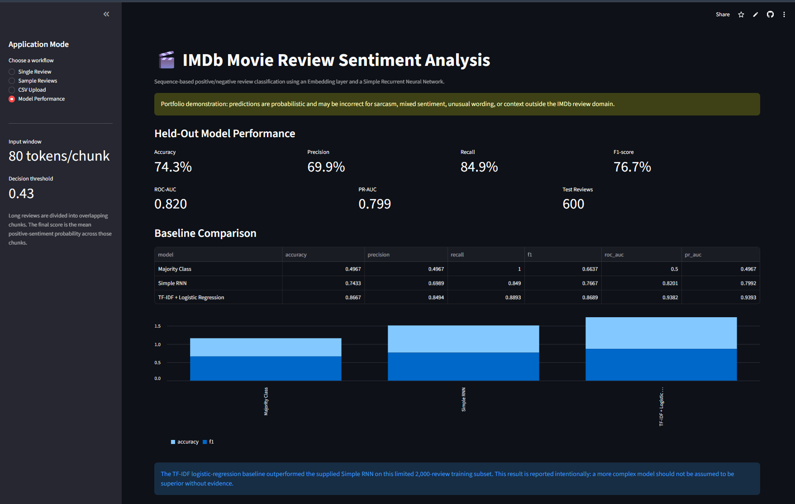

---


---

## Project Status and Honest Scope

The supplied source project was an IMDb sentiment-classification workflow rather than a
general movie-rating analysis project. It used synthetic reviews to validate the pipeline
and then loaded real IMDb reviews from the TensorFlow/Keras dataset.

The original run used 2,000 real training reviews, 600 real test reviews, a vocabulary of
8,000 words, a 120-token sequence, and only two final training epochs. The original real
test accuracy was **50.67%**, with positive recall of **36.58%**.

This portfolio version keeps the Simple RNN as the primary neural architecture but corrects
the most important experimental and deployment weaknesses. The included saved model is
trained on the supplied 2,000-review subset, so its result should be interpreted as a
transparent architecture demonstration rather than state-of-the-art sentiment analysis.

---

## Improvements Made to the Original Project

| Original implementation | Portfolio-ready implementation |
|---|---|
| Synthetic reviews mixed into final real-data training | Synthetic data retained only as a development reference |
| Real test rows sampled into validation | Validation created only from the training set |
| Test set reused after validation exposure | Final 600-review test set kept untouched |
| Two training epochs | Model selection with repeated epochs and validation monitoring |
| One 120-token truncation | Overlapping 80-token chunks, capped at six per review |
| One prediction per truncated sequence | Mean probability aggregated across review chunks |
| Vocabulary fitted inside the live app | Saved tokenizer reused consistently |
| Model trained during every Streamlit session | Pretrained `.keras` model loaded for inference |
| TensorFlow failure silently changed the project to logistic regression | Simple RNN remains the explicit deployed model |
| Accuracy-focused evaluation | Full classification, ranking, and error metrics |
| No meaningful baseline conclusion | TF-IDF baseline reported and discussed honestly |
| Full review exports encouraged | GitHub-safe sample and de-identified outputs only |

### Confusion-matrix improvement

| Outcome | Original run | Updated Simple RNN |
|---|---:|---:|
| True negatives | 195 | **193** |
| False positives | 107 | **109** |
| False negatives | 189 | **45** |
| True positives | 109 | **253** |

The updated threshold substantially improves positive-review recall, although specificity
remains a limitation.

---

## Dataset

The supplied notebook loaded IMDb movie reviews using the TensorFlow/Keras built-in
dataset and decoded the integer sequences into text.

Reviewed source-run scope:

| Dataset component | Rows |
|---|---:|
| Real training reviews | 2,000 |
| Real test reviews | 600 |
| Synthetic development reviews | 600 |
| Positive/negative labels | Approximately balanced |

The complete raw review text is excluded from this GitHub-ready package. The repository
includes:

```text
data/sample_reviews.csv
```

This small file contains hand-written, privacy-safe reviews for application testing.

See [`data/README_data.md`](data/README_data.md) for schema, source, and repository-safety
guidance.

---

## Exploratory Data Analysis

### Sentiment distribution

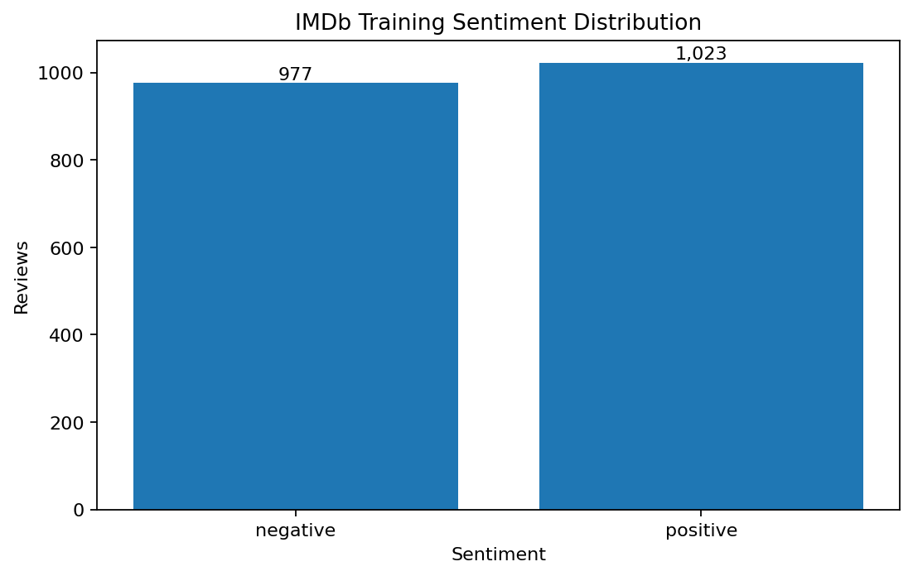

### Review length distribution

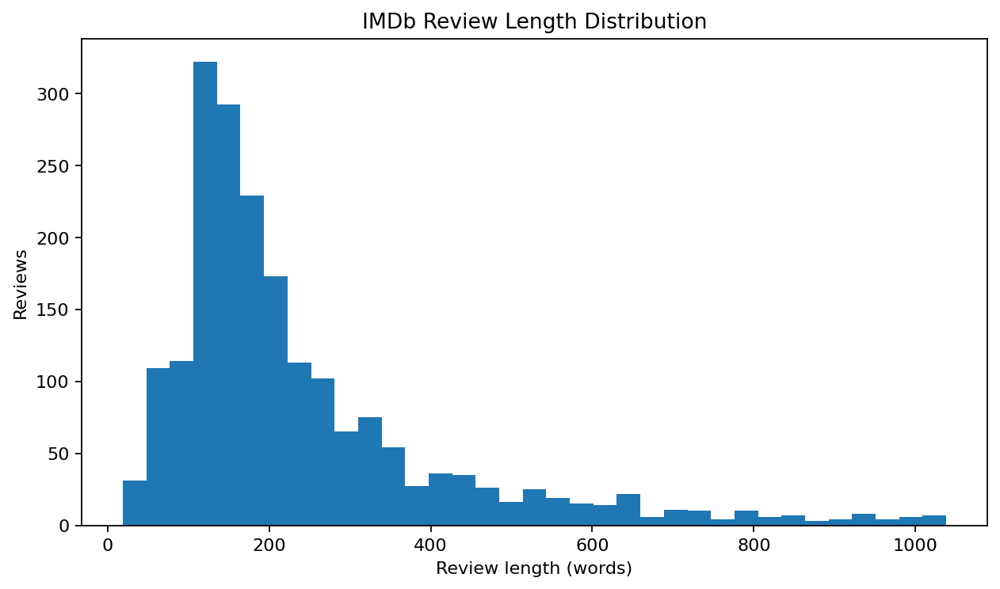

### Average review length by sentiment

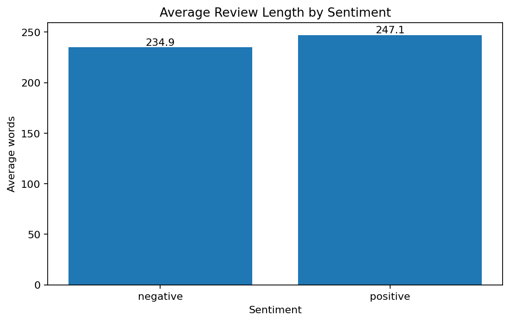

### Common positive terms

The following terms come from the interpretable TF-IDF logistic-regression baseline rather
than the RNN itself.

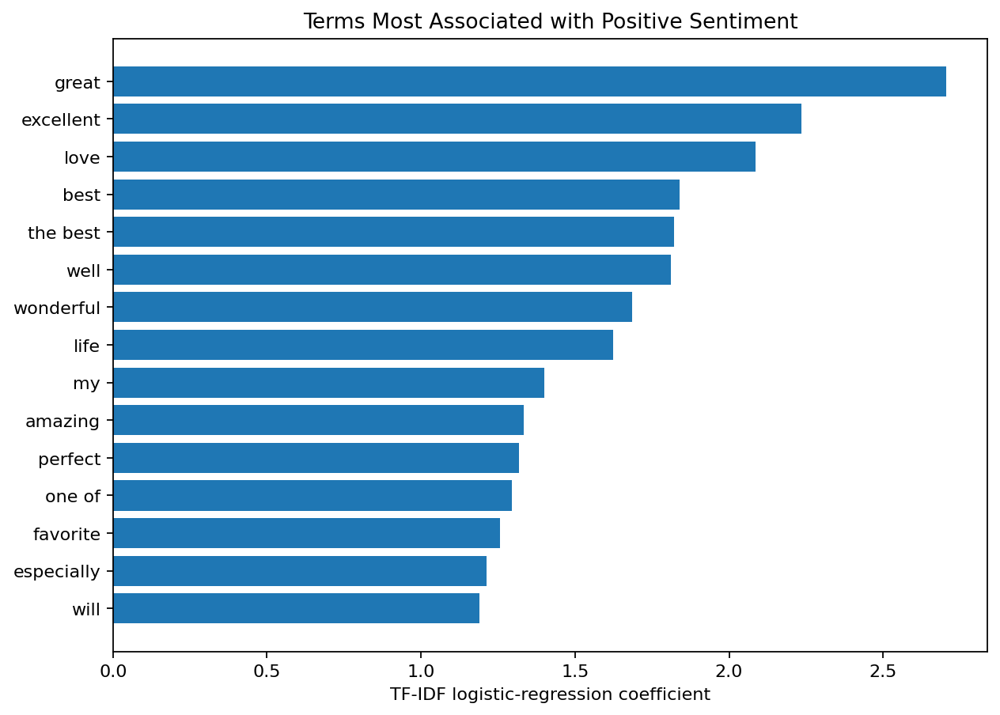

### Common negative terms

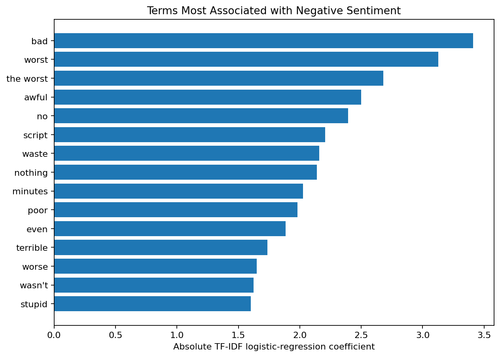

---

## Text Preprocessing

The shared training and inference pipeline performs:

1. HTML entity decoding
2. `<br>` and IMDb control-token cleanup
3. Lowercasing
4. Unsupported-character removal
5. Extra-whitespace normalization
6. Deterministic tokenization
7. Out-of-vocabulary mapping
8. Vocabulary-size control

Stop words and negations are not removed because phrases such as `not good` and `never
enjoyed` contain important sentiment information.

---

## Sequence Generation

Long reviews are not represented by one aggressively truncated sequence.

```text
Chunk length:       80 tokens
Chunk stride:       60 tokens
Maximum chunks:     6 per review
Padding:            Post-padding
Review prediction:  Mean probability across chunks
```

This approach gives the Simple RNN multiple local sections of a long review while limiting
deployment cost.

---

## Simple RNN Architecture

```text
Integer token chunk: (80,)
            ↓
Embedding: 80 dimensions
            ↓
SimpleRNN: 48 tanh units
            ↓
Dense: 32 ReLU units
            ↓
Dropout: 0.30
            ↓
Dense: 1 sigmoid output
            ↓
Positive-sentiment probability
```

Training uses binary cross-entropy, Adam optimization, gradient-aware validation, and
review-level splitting.

---

## Sentiment Decision Logic

The model outputs a positive-sentiment probability.

```text
Probability >= 0.43 → Positive
Probability <  0.43 → Negative
```

The **0.43 threshold was selected using validation data only** to improve the balance
between positive precision and recall. The final test set was not used to select the
threshold.

Confidence is shown as the probability assigned to the predicted class:

```text
Positive prediction confidence = positive probability
Negative prediction confidence = 1 − positive probability
```

Predictions below 65% confidence are flagged as uncertain in the app.

---

## Held-Out Test Results

### Simple RNN

| Metric | Result |
|---|---:|
| Accuracy | **74.33%** |
| Balanced accuracy | **74.40%** |
| Precision | **69.89%** |
| Recall | **84.90%** |
| F1-score | **76.67%** |
| Specificity | **63.91%** |
| ROC-AUC | **0.820** |
| PR-AUC | **0.799** |
| Matthews correlation coefficient | **0.499** |
| Test reviews | **600** |

### Model comparison

| Model | Accuracy | Precision | Recall | F1 | ROC-AUC | PR-AUC |
|---|---:|---:|---:|---:|---:|---:|
| Majority class | 50.33% | 0.00% | 0.00% | 0.00% | 0.500 | 0.497 |
| **Simple RNN** | **74.33%** | **69.89%** | **84.90%** | **76.67%** | **0.820** | **0.799** |
| **TF-IDF + Logistic Regression** | **86.67%** | **84.94%** | **88.93%** | **86.89%** | **0.938** | **0.939** |

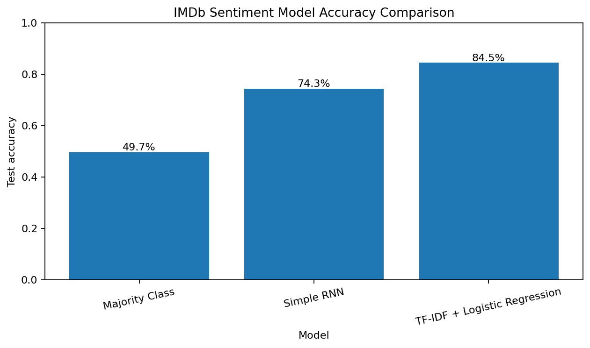

The classical baseline outperforms the Simple RNN on this limited subset. This is an
important analytical finding: neural-network complexity does not automatically produce
better generalization. The Simple RNN remains the primary project model because this
repository demonstrates recurrent sequence modeling, but the baseline would be preferred
for this specific evaluated configuration.

### Metric interpretation

- **Accuracy:** overall percentage of correctly classified reviews.
- **Precision:** reliability of positive predictions.
- **Recall:** percentage of actual positive reviews captured.
- **F1-score:** harmonic balance of precision and recall.
- **Specificity:** percentage of actual negative reviews correctly identified.
- **ROC-AUC:** ranking quality across all classification thresholds.
- **PR-AUC:** precision–recall quality, especially useful when class balance changes.
- **MCC:** correlation-style summary using all four confusion-matrix outcomes.

---

## Model Evaluation

### Confusion matrix

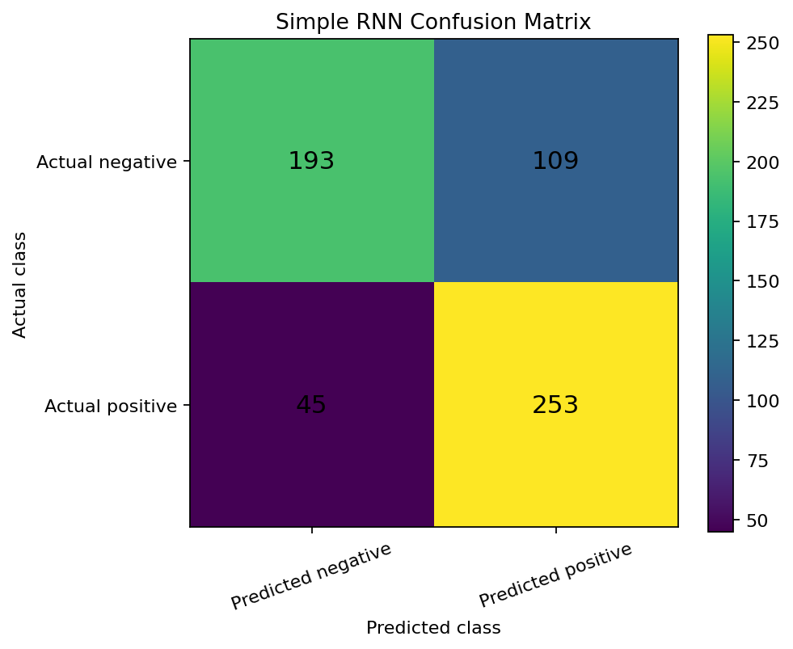

### ROC curve

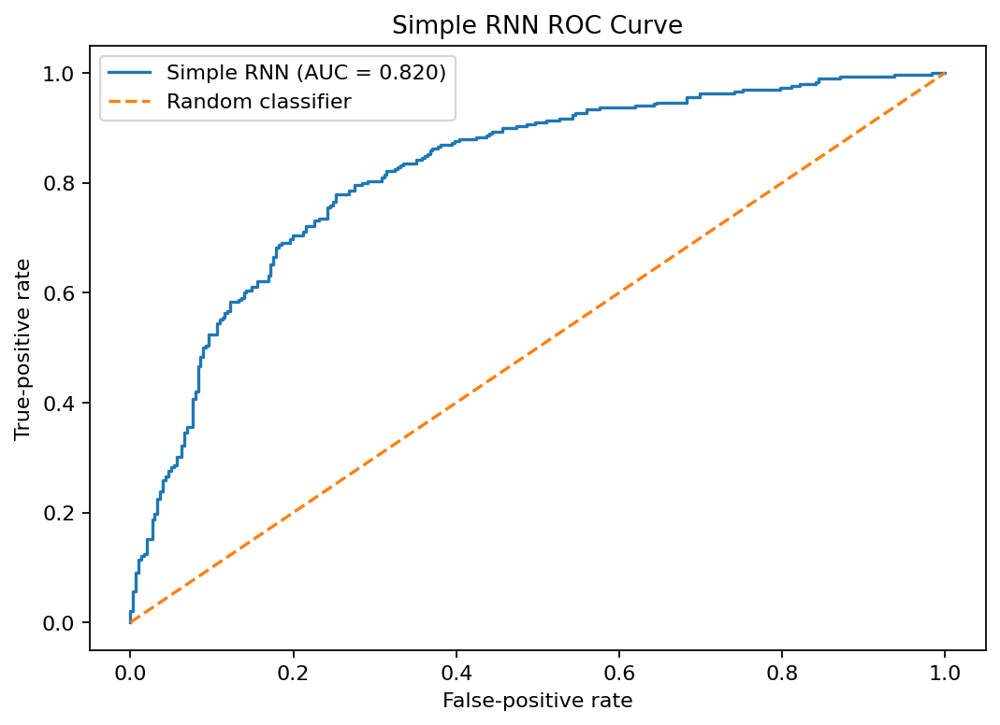

### Precision–recall curve

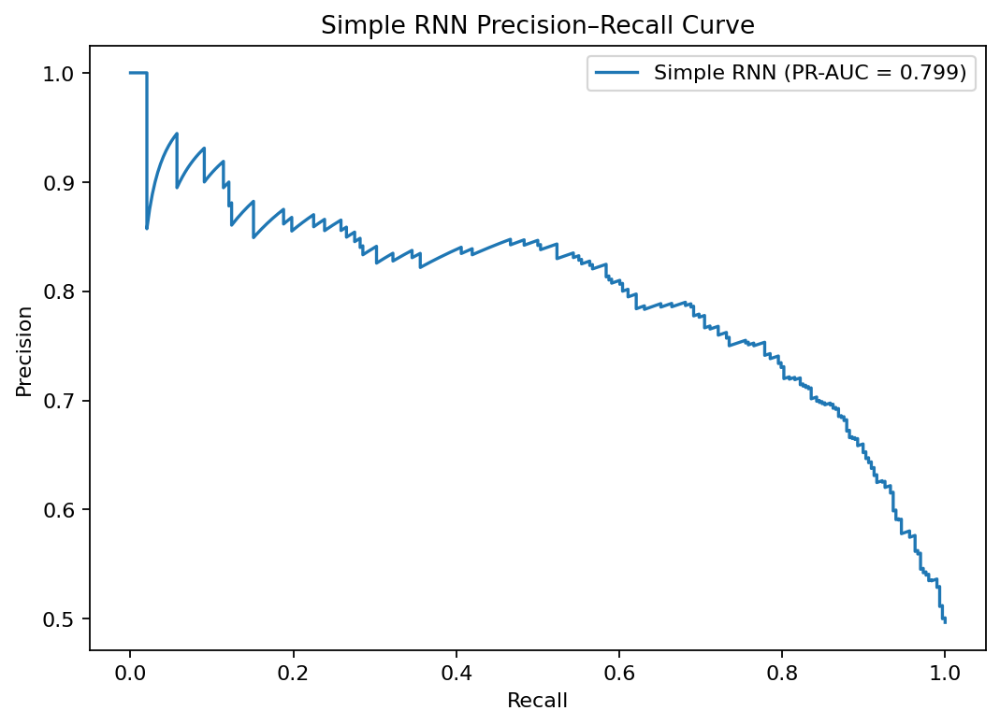

### Training and validation accuracy

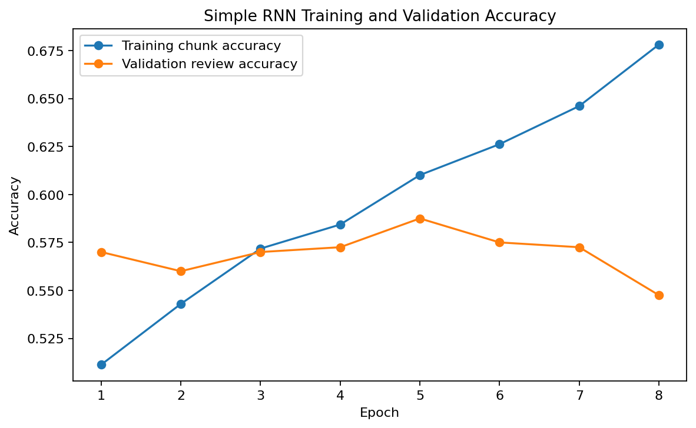

### Training and validation loss

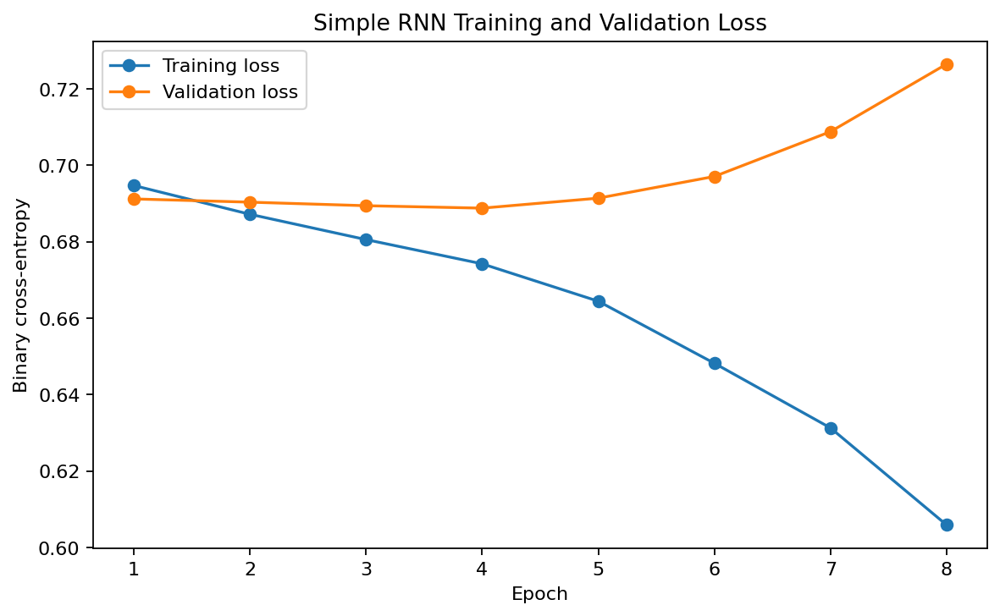

### Probability distribution

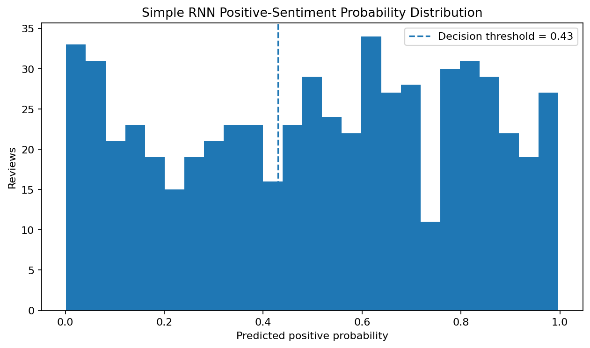

---

## Error Analysis

The project saves a de-identified error sample at:

```text
outputs/error_analysis.csv
```

Common causes of sentiment-classification errors include:

- sarcasm and irony;
- mixed positive and negative statements;
- long reviews containing conflicting sections;
- rare or unknown vocabulary;
- references whose sentiment depends on outside context;
- negative wording used to praise a film, such as “not bad”; and
- the limited long-term memory of a basic Simple RNN.

The model has stronger positive recall than negative specificity. Therefore, false-positive
review of ambiguous language is especially important.

---

## Streamlit Application

The deployed application supports four workflows:

1. **Single Review** — type or paste a movie review and receive an immediate sentiment prediction.
2. **Sample Reviews** — score included hand-written examples and inspect their predicted sentiment distribution.
3. **CSV Upload** — batch-score up to 1,000 reviews from a compatible file.
4. **Model Performance** — inspect held-out metrics, baseline comparisons, diagnostic charts, and error-analysis examples.

The app displays:

- cleaned review text;
- token and chunk counts;
- predicted sentiment;
- positive probability;
- predicted-class confidence;
- confidence band;
- interpretation text;
- batch sentiment distribution;
- baseline comparison;
- confusion matrix, ROC, precision–recall, training, and loss charts; and
- downloadable scored CSV output.

**Live application:** [Open the IMDb Sentiment Analysis application](https://simple-rnn-projects-ljp2wrybnrz4eheng2xsd8.streamlit.app/)

---

## Saved Artifacts

| File | Purpose |
|---|---|
| `models/imdb_simple_rnn_model.keras` | Saved Keras Simple RNN |
| `models/tokenizer.json` | Vocabulary and chunking metadata |
| `models/model_metadata.json` | Architecture, threshold, data, and metric metadata |
| `outputs/model_metrics.json` | Simple RNN test metrics |
| `outputs/model_comparison.csv` | Majority, RNN, and TF-IDF baseline comparison |
| `outputs/test_predictions.csv` | De-identified test probabilities and labels |
| `outputs/classification_report.csv` | Per-class precision, recall, F1, and support |
| `outputs/error_analysis.csv` | Short excerpts from selected mistakes |
| `outputs/training_history.csv` | Training diagnostic history |
| `outputs/threshold_analysis.csv` | Validation threshold analysis |
| `outputs/top_terms.csv` | Interpretable baseline terms |

---

## Project Structure

```text
simple-rnn-projects/
├── .github/
│   └── workflows/
│       └── imdb-simple-rnn-ci.yml
│
└── 03-imdb-data-analysis/
    ├── app/
    │   ├── streamlit_app.py
    │   └── requirements.txt
    ├── data/
    │   ├── README_data.md
    │   └── sample_reviews.csv
    ├── images/
    │   ├── README.md
    │   ├── 01_streamlit_application_overview.png
    │   ├── 02_single_review_prediction.png
    │   ├── 03_batch_sentiment_workflow.png
    │   └── 04_model_performance_and_error_analysis.png
    ├── models/
    │   ├── imdb_simple_rnn_model.keras
    │   ├── tokenizer.json
    │   ├── model_metadata.json
    │   └── MODEL_CARD.md
    ├── notebooks/
    │   ├── imdb_data_analysis.ipynb
    │   └── archive/
    │       ├── imdb_data_analysis_original.ipynb
    │       └── streamlit_prototype_original.py
    ├── outputs/
    │   ├── sentiment_distribution.png
    │   ├── review_length_distribution.png
    │   ├── average_review_length.png
    │   ├── top_positive_terms.png
    │   ├── top_negative_terms.png
    │   ├── confusion_matrix.png
    │   ├── roc_curve.png
    │   ├── precision_recall_curve.png
    │   ├── training_accuracy.png
    │   ├── training_loss.png
    │   ├── baseline_comparison.png
    │   ├── probability_distribution.png
    │   └── evaluation CSV/JSON artifacts
    ├── src/
    │   ├── __init__.py
    │   ├── config.py
    │   ├── data_preprocessing.py
    │   ├── text_preprocessing.py
    │   ├── sequence_generation.py
    │   ├── model_training.py
    │   ├── model_evaluation.py
    │   ├── sentiment_pipeline.py
    │   └── visualization.py
    ├── tests/
    ├── .gitignore
    ├── .python-version
    ├── README.md
    ├── README_HOSTING.md
    ├── requirements.txt
    ├── requirements-ci.txt
    └── train_model.py
```

---

## Run Locally

Use Python 3.12.

### Windows Command Prompt

```bat
set "PATH=%USERPROFILE%\Tools\PortableGit\cmd;%PATH%"
cd /d "%USERPROFILE%\OneDrive - Veralto\Desktop\AI Codes\GIT Projects\simple-rnn-projects\03-imdb-data-analysis"
python -m venv "%USERPROFILE%\venvs\simple-rnn-imdb"
call "%USERPROFILE%\venvs\simple-rnn-imdb\Scripts\activate.bat"
python -m pip install --upgrade pip setuptools wheel
python -m pip install -r requirements.txt
python -m streamlit run app\streamlit_app.py
```

Open:

```text
http://localhost:8501
```

### Future local runs

```bat
cd /d "%USERPROFILE%\OneDrive - Veralto\Desktop\AI Codes\GIT Projects\simple-rnn-projects\03-imdb-data-analysis"
call "%USERPROFILE%\venvs\simple-rnn-imdb\Scripts\activate.bat"
python -m streamlit run app\streamlit_app.py
```

---

## Optional Retraining

The included application runs without retraining.

To retrain from the Keras IMDb dataset:

```bat
python train_model.py --train-limit 10000 --test-limit 5000 --epochs 25
```

The dataset is downloaded by Keras when it is not already cached. Retraining replaces the
saved model, tokenizer, metadata, predictions, metrics, and comparison files.

For a stronger production-style experiment, use the full training set and repeat evaluation
across multiple random seeds.

---

## Testing

Run:

```bat
python -m pytest -q
```

The CI workflow validates text cleaning, vocabulary behavior, sequence generation,
probability aggregation, thresholding, and Python compilation.

---

## Deployment

The application is deployed on Streamlit Community Cloud and connected directly to the `main` branch of this GitHub repository.

**Live application:**  
[Open the IMDb Movie Review Sentiment Analysis application](https://simple-rnn-projects-ljp2wrybnrz4eheng2xsd8.streamlit.app/)

**Streamlit entry point:**

```text
03-imdb-data-analysis/app/streamlit_app.py
```

**Deployment configuration:**

```text
Repository: unit-mole/simple-rnn-projects
Branch: main
Python: 3.12
```

Changes pushed to the relevant project files on the `main` branch automatically trigger a Streamlit application update.

See [README_HOSTING.md](README_HOSTING.md) for deployment configuration, maintenance instructions, and troubleshooting guidance.

---

## Data and Repository Safety

- Full raw IMDb reviews are not committed.
- The included sample reviews are hand-written and privacy-safe.
- Saved predictions use review IDs instead of complete review text.
- Error-analysis excerpts are intentionally short.
- Virtual environments, caches, temporary exports, and secrets are ignored.
- Streamlit secrets must never be committed.
- Only the four curated application screenshots are stored under `images/`.

---

## Known Limitations

- The saved RNN was trained on only 2,000 real reviews.
- The TF-IDF logistic baseline performs materially better.
- Chunk averaging may dilute one highly important sentence.
- The selected threshold favors positive recall over negative specificity.
- Simple RNNs can forget long-range dependencies and suffer from vanishing gradients.
- The model is not calibrated for reviews outside the IMDb domain.
- Sarcasm, mixed sentiment, and unusual language remain difficult.
- Probability should not be interpreted as certainty or causal word attribution.

---

## Future Improvements

- Train on the complete Keras IMDb training set
- Use repeated-seed evaluation and confidence intervals
- Compare Simple RNN with LSTM, GRU, CNN, and Transformer architectures
- Add probability calibration
- Explore attention over review chunks
- Add local token-importance explanations
- Evaluate robustness to negation, sarcasm, spelling errors, and domain shift
- Add model and vocabulary drift monitoring
- Introduce a human-review queue for low-confidence predictions

---

## Skills Demonstrated

`Natural Language Processing` · `Text Cleaning` · `Tokenization` · `Vocabulary Management` ·
`Sequence Padding` · `Chunked Text Modeling` · `Word Embeddings` · `Simple RNN` ·
`Binary Classification` · `Threshold Selection` · `ROC-AUC` · `PR-AUC` ·
`Baseline Comparison` · `Error Analysis` · `Model Serialization` · `Streamlit` ·
`Testing` · `CI/CD`

---

## Portfolio Description

**One-line description**

> Built and deployed a chunk-aware Simple RNN that classifies IMDb movie-review sentiment, reports probability-based confidence, and benchmarks performance against an interpretable TF-IDF baseline.

**Pinned-repository description**

> End-to-end IMDb sentiment-analysis project featuring NLP preprocessing, embedding-based Simple RNN sequence modeling, validation thresholding, baseline comparison, error analysis, saved artifacts, testing, CI/CD, and Streamlit deployment.

**Resume bullet**

> Developed a modular IMDb sentiment-classification pipeline using deterministic text preprocessing, overlapping sequence chunks, Keras Simple RNN modeling, validation-based threshold selection, ROC/PR evaluation, baseline benchmarking, error analysis, and interactive Streamlit deployment.

---

## Career Positioning

This project supports a transition from Quality Data Scientist work into broader Data
Science, ML, and Applied AI roles by demonstrating the ability to:

- turn unstructured text into a reproducible sequence-modeling workflow;
- identify and correct validation leakage;
- preserve consistency between training and inference;
- evaluate neural and classical models without hiding an unfavorable comparison;
- analyze false positives, false negatives, and uncertain predictions; and
- convert experimental NLP code into a tested, deployable application.

---

## Responsible Use

The application estimates review sentiment. It should not be used to make consequential
decisions about individuals, employees, customers, or creative professionals without
domain-specific validation and human oversight.

---

## Author

**Anmol Tripathi**  
Quality Data Scientist | Data Science | Machine Learning | Applied AI | Analytics
