# SMS Spam Detection using Simple RNN

[](https://www.python.org/)
[](https://www.tensorflow.org/)
[](https://keras.io/)
[](README_HOSTING.md)
[](../LICENSE)
[](https://github.com/unit-mole/simple-rnn-projects/actions/workflows/sms-spam-rnn-ci.yml)

An end-to-end Natural Language Processing project that uses an **Embedding layer and
Simple Recurrent Neural Network** to classify SMS messages as legitimate (`ham`) or
`spam`. The project includes spam-aware text normalization, training-only vocabulary
creation, class-weighted learning, stratified train/validation/test separation,
validation-based threshold selection, classical NLP baselines, error analysis, saved
inference artifacts, automated tests, and an interactive Streamlit application.

**Status:** Portfolio-ready · deployment pending  
**Live demo:** `ADD-LIVE-STREAMLIT-URL-HERE`  
**Primary stack:** Python · TensorFlow/Keras · scikit-learn · pandas · Streamlit

> [!IMPORTANT]
> **Responsible use and privacy:** This project is for educational and portfolio
> demonstration purposes only. It should not be used as the sole basis for blocking,
> filtering, monitoring, or taking action on real user messages. Do not upload private,
> sensitive, personal, financial, authentication, health, employer, or customer SMS
> content into the public demo. The model may make incorrect predictions.

---

## Business Problem

Message-filtering systems must distinguish unwanted or malicious promotional content from
legitimate communication. The cost of an error is asymmetric:

- a **false positive** may hide a legitimate message; and
- a **false negative** allows spam to pass through.

This project answers:

> Given an SMS message, can a Simple RNN estimate its spam probability and classify it as spam or legitimate?

The application produces:

- **Predicted class:** Spam or Ham
- **Spam probability**
- **Threshold-distance confidence**
- **Confidence band**
- **Message interpretation**
- **Visible surface cues**
- **Batch class distribution**
- **Downloadable scored CSV**

---

## Project Highlights

- Real SMS Spam Collection data used by the supplied notebook
- 5,101 normalized, deduplicated modeling messages
- Zero normalized-text overlap across training, validation, and test partitions
- Stratified 70% / 15% / 15% split
- Class weights calculated from the training partition
- URL, phone, currency, and number patterns preserved as semantic tokens
- 5,000-word vocabulary fitted on training data only
- 50-token fixed-length message sequences
- Embedding → SimpleRNN → Dense binary classifier
- Early stopping and learning-rate reduction
- Validation-selected spam threshold of **0.255**
- Accuracy, balanced accuracy, precision, recall, F1, specificity, ROC-AUC, PR-AUC, and MCC
- Majority, Multinomial Naive Bayes, and TF-IDF Logistic Regression baselines
- Manual message, privacy-safe sample, and CSV batch workflows
- Saved `.keras` model, JSON tokenizer, metadata, tests, and GitHub Actions CI

---

## Application Preview

Screenshots will be added after the public Streamlit application is deployed and tested.

Use these exact filenames:

```text
images/01_streamlit_application_overview.png
images/02_single_message_prediction.png
images/03_batch_spam_detection_workflow.png
images/04_model_performance_and_error_analysis.png
```

---

## Original Project Review

The supplied files correctly implemented SMS spam-versus-ham classification using an
Embedding layer and Simple RNN. The notebook loaded 5,572 real records and reported
93.54% accuracy with a 75.68% spam F1-score.

### Essential corrections

| Original implementation | Portfolio-ready implementation |
|---|---|
| Repeated synthetic templates used by the deployed app | Saved model trained on cleaned real SMS data |
| Model trained during every Streamlit session | Pretrained `.keras` model loaded for inference |
| Real test split reused as validation during training | Separate stratified train, validation, and untouched test partitions |
| 118 overlapping train/test texts reported | Normalized duplicates removed before splitting; overlap equals zero |
| No RNN class weighting | Balanced class weights fitted from training labels |
| Threshold sweep performed on test predictions | Threshold selected using validation data only |
| Limited metric reporting | Full classification, ranking, specificity, and MCC metrics |
| No saved tokenizer or model | Saved model, tokenizer, metadata, and model card |
| TensorFlow failure changed the demonstrated model | Deployed app requires the saved Simple RNN explicitly |
| Minimal Streamlit workflow | Manual, sample, batch, performance, privacy, and download workflows |
| No automated validation | Unit tests and project-specific GitHub Actions CI |

---

## Dataset

| Dataset detail | Result |
|---|---:|
| Raw rows | 5,572 |
| Blank normalized messages removed | 2 |
| Normalized duplicates removed | 469 |
| Modeling rows | 5,101 |
| Ham messages | 4,499 |
| Spam messages | 602 |
| Spam prevalence | 11.80% |
| Training rows | 3,570 |
| Validation rows | 765 |
| Test rows | 766 |
| Cross-partition text overlap | 0 |

The full corpus is not committed. The repository includes only:

```text
data/sample_sms_messages.csv
```

The sample contains hand-written, privacy-safe examples for application testing.

See [`data/README_data.md`](data/README_data.md) for source, schema, supported
uploads, and privacy guidance.

---

## Exploratory Data Analysis

### Class distribution

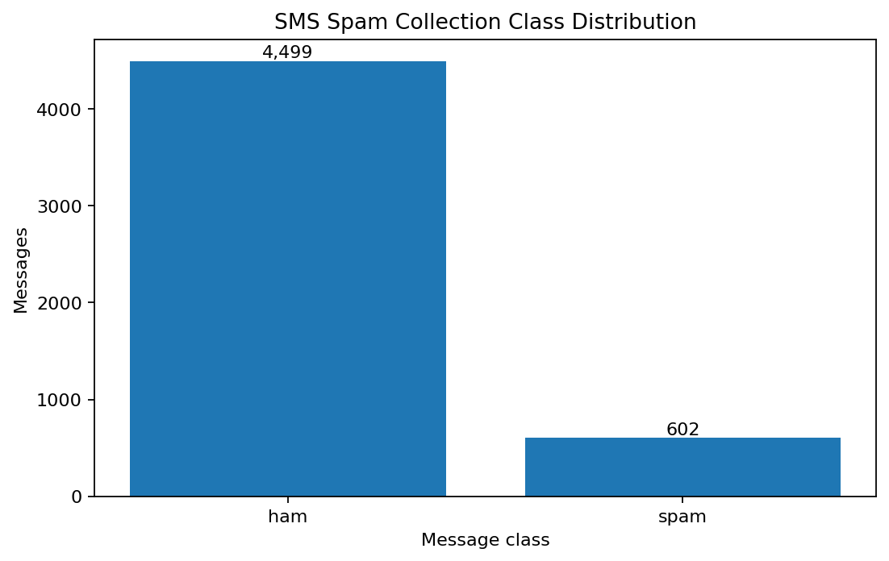

The cleaned corpus is imbalanced: approximately 11.8% of messages are spam.

### Message length distribution

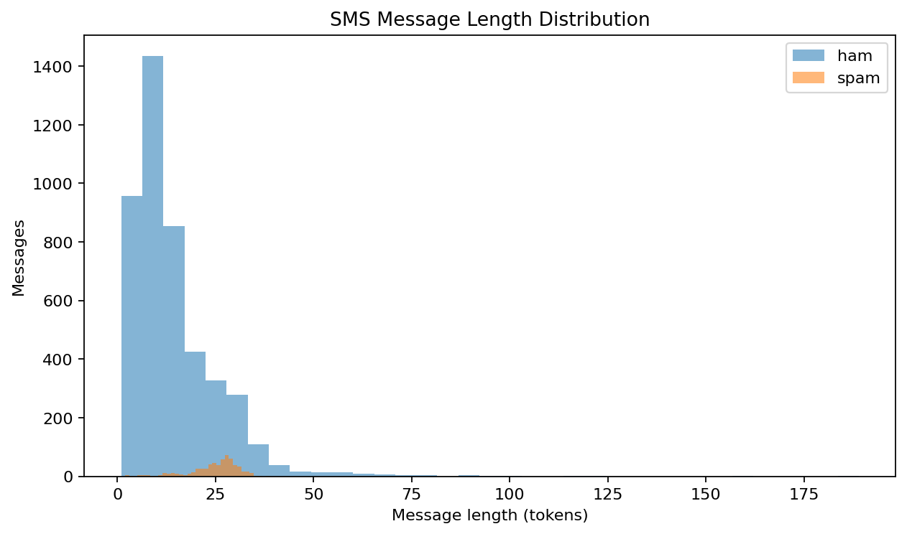

### Average message length by class

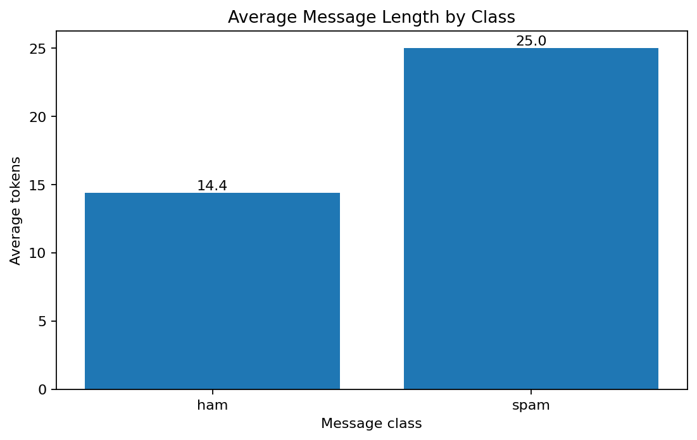

### Terms associated with spam

The term charts come from the interpretable TF-IDF Logistic Regression baseline,
not from the recurrent neural network.

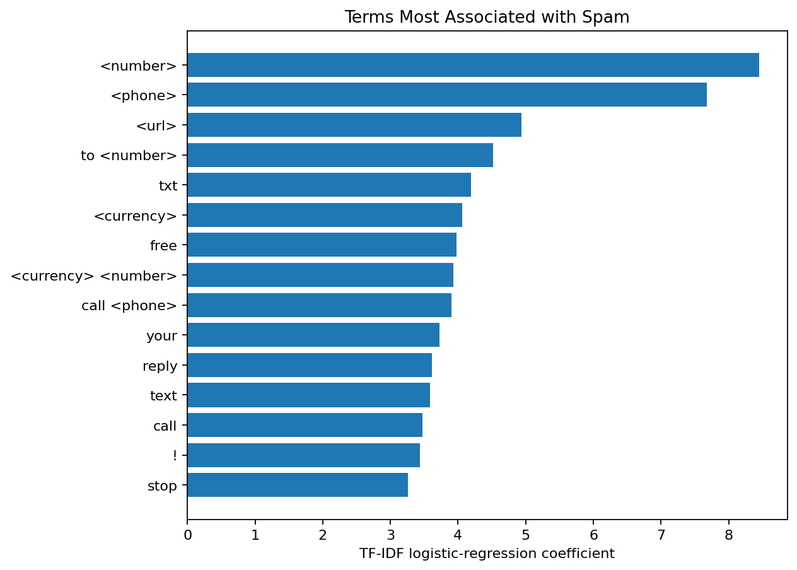

### Terms associated with legitimate messages

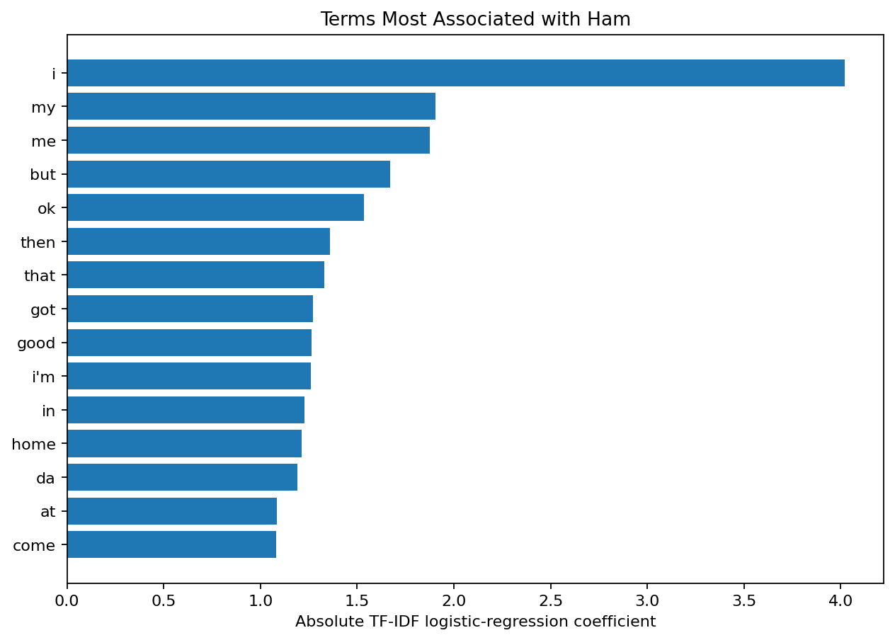

---

## Text Preprocessing

The shared training and inference pipeline performs:

1. HTML entity decoding
2. Lowercasing
3. URL replacement with `<url>`
4. Phone-pattern replacement with `<phone>`
5. Currency-symbol replacement with `<currency>`
6. Number replacement with `<number>`
7. Controlled special-character cleanup
8. Whitespace normalization
9. Deterministic tokenization
10. Out-of-vocabulary mapping

Exclamation marks, question marks, percentage signs, promotional words, and the
presence of links, numbers, phone patterns, and currency remain available as signals.

---

## Sequence Generation

```text
Maximum vocabulary:      5,000 tokens
Learned vocabulary:      5,000 tokens
Maximum sequence length: 50 tokens
Padding:                 Post-padding
Truncation:              Post-truncation
Out-of-vocabulary index: 1
Padding index:           0
```

More than 95% of cleaned messages fit within the selected sequence length.

---

## Simple RNN Architecture

```text
Integer token sequence: (50,)
            ↓
Embedding: 64 dimensions
            ↓
SimpleRNN: 48 tanh units
            ↓
Dense: 24 ReLU units
            ↓
Dropout: 0.30
            ↓
Dense: 1 sigmoid output
            ↓
Spam probability
```

Training uses Adam optimization, binary cross-entropy, balanced class weights,
early stopping, and learning-rate reduction.

---

## Class Imbalance Handling

The project uses:

- stratified training, validation, and test partitions;
- training-partition class weights;
- validation-only threshold tuning;
- PR-AUC in addition to ROC-AUC;
- spam precision, recall, and F1 as primary metrics; and
- explicit false-positive and false-negative analysis.

```text
Ham class weight:  0.567
Spam class weight: 4.240
```

---

## Spam Prediction Logic

```text
Spam probability >= 0.255 → Spam
Spam probability <  0.255 → Ham
```

The threshold was selected by maximizing spam F1-score on validation data, with
spam precision and balanced accuracy used as tie-breakers. The final test set was
not used for threshold selection.

The app's **decision confidence** is a normalized measure of distance from the
selected threshold. It is not a calibrated probability of correctness.

---

## Held-Out Test Results

### Simple RNN

| Metric | Result |
|---|---:|
| Accuracy | **98.04%** |
| Balanced accuracy | **96.04%** |
| Spam precision | **90.43%** |
| Spam recall | **93.41%** |
| Spam F1-score | **91.89%** |
| Ham specificity | **98.67%** |
| ROC-AUC | **0.987** |
| PR-AUC | **0.961** |
| Matthews correlation coefficient | **0.908** |
| Test messages | **766** |

### Model comparison

| Model | Accuracy | Spam Precision | Spam Recall | Spam F1 | ROC-AUC | PR-AUC |
|---|---:|---:|---:|---:|---:|---:|
| Majority Class | 88.12% | 0.00% | 0.00% | 0.00% | 0.500 | 0.119 |
| Multinomial Naive Bayes | **98.30%** | **100.00%** | **85.71%** | **92.31%** | **0.989** | **0.976** |
| TF-IDF + Logistic Regression | **98.83%** | **95.56%** | **94.51%** | **95.03%** | **0.994** | **0.980** |
| Simple RNN | **98.04%** | **90.43%** | **93.41%** | **91.89%** | **0.987** | **0.961** |

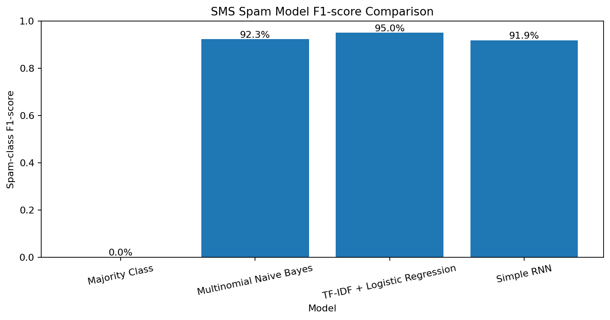

TF-IDF Logistic Regression is strongest on this split. The Simple RNN remains
the primary architecture because this repository demonstrates recurrent sequence
modeling, but the classical baseline would be preferred here when predictive
performance is the only objective.

### Metric interpretation

- **Accuracy:** overall percentage of correctly classified messages.
- **Spam precision:** reliability of messages labeled as spam.
- **Spam recall:** percentage of actual spam messages detected.
- **Spam F1:** balance between spam precision and recall.
- **Specificity:** percentage of legitimate messages correctly retained.
- **ROC-AUC:** overall ranking quality across thresholds.
- **PR-AUC:** spam-focused ranking quality under class imbalance.
- **MCC:** summary measure using all four confusion-matrix outcomes.

---

## Model Evaluation

### Confusion matrix

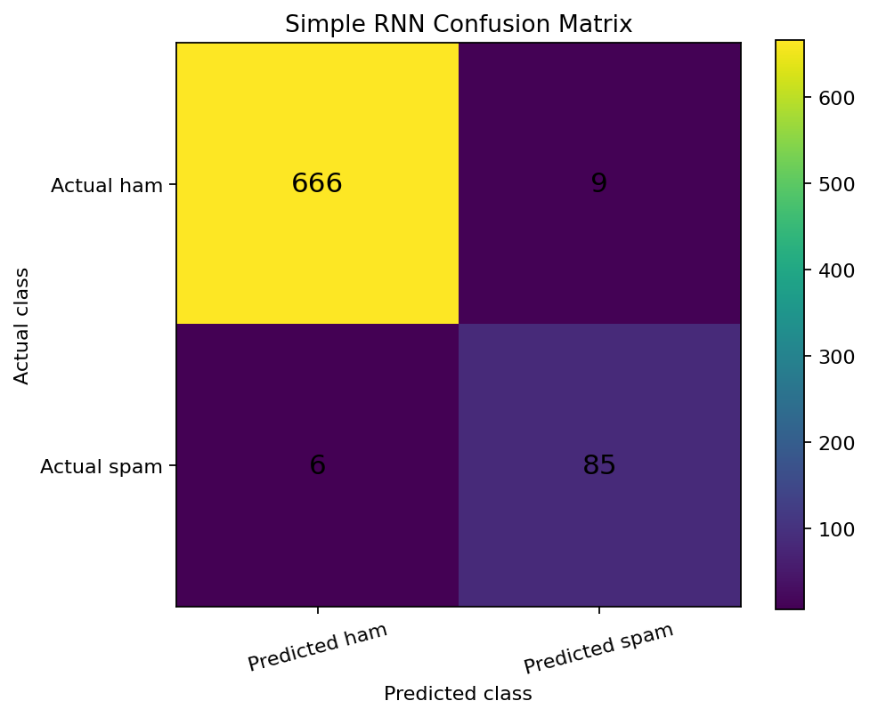

### ROC curve

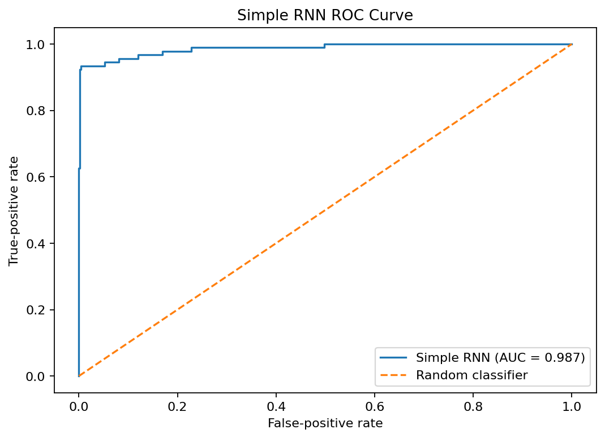

### Precision–recall curve

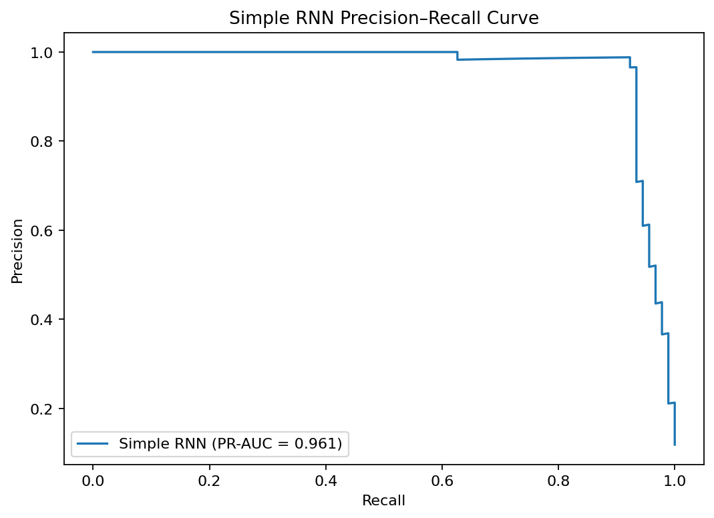

### Validation threshold analysis

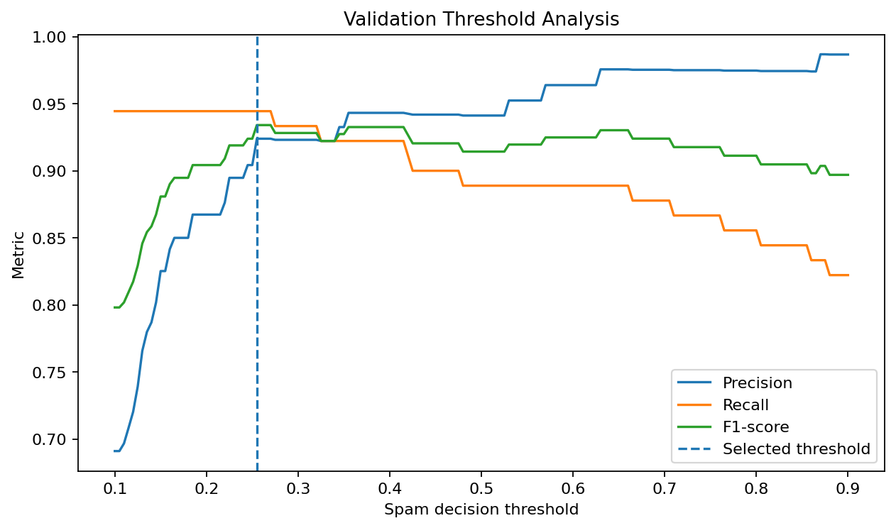

### Training and validation accuracy

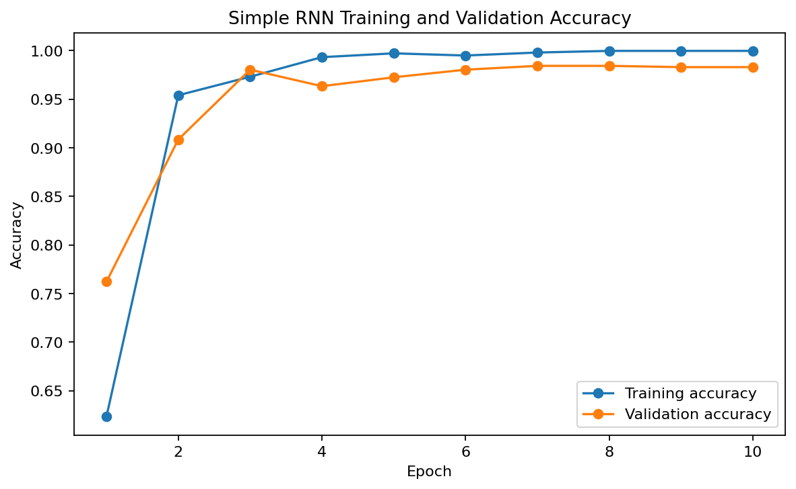

### Training and validation loss

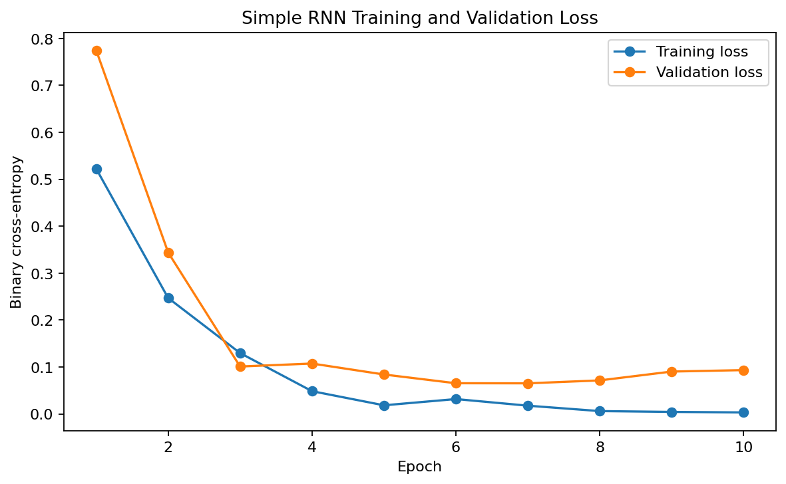

### Spam-probability distribution

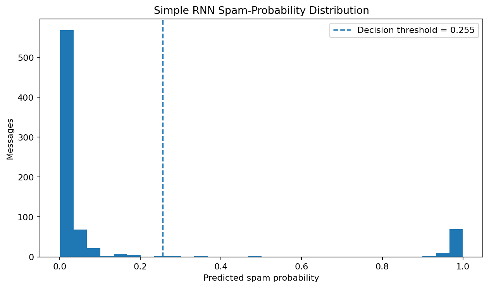

---

## Error Analysis

The project stores selected public-corpus errors in:

```text
outputs/error_analysis.csv
```

Typical causes include:

- legitimate promotional or appointment messages containing promotional terms;
- spam written in conversational language;
- very short messages with insufficient context;
- ambiguous numbers, links, phone patterns, or currency references;
- unusual abbreviations and spelling;
- unseen vocabulary; and
- threshold trade-offs between blocking spam and preserving legitimate messages.

False positives deserve special attention because a filter can hide important
legitimate communication.

---

## Streamlit Application

The application supports:

1. **Single Message** — type or paste one SMS message.
2. **Sample Messages** — score included privacy-safe examples.
3. **CSV Upload** — batch-score up to 1,000 messages.
4. **Model Performance** — inspect metrics, baselines, charts, and errors.

The app displays:

- original and cleaned message text;
- spam probability;
- predicted class;
- decision confidence and confidence band;
- visible surface cues clearly separated from model attribution;
- token, truncation, and OOV diagnostics;
- batch class distribution;
- optional uploaded-label accuracy; and
- downloadable template and scored CSV files.

The app never retrains during a user session and does not silently replace the
Simple RNN with another classifier.

---

## Project Structure

```text
simple-rnn-projects/
├── .github/
│   └── workflows/
│       └── sms-spam-rnn-ci.yml
│
└── 04-sms-spam-detection/
    ├── app/
    ├── data/
    ├── images/
    ├── models/
    ├── notebooks/
    ├── outputs/
    ├── src/
    ├── tests/
    ├── .gitignore
    ├── .python-version
    ├── PROJECT_REVIEW.md
    ├── README.md
    ├── README_HOSTING.md
    ├── requirements.txt
    ├── requirements-ci.txt
    ├── run_app.bat
    ├── train_model.py
    └── validate_project.py
```

---

## Run Locally

Use Python 3.12.

```bat
set "PATH=%USERPROFILE%\Tools\PortableGit\cmd;%PATH%"
cd /d "%USERPROFILE%\OneDrive - Veralto\Desktop\AI Codes\GIT Projects\simple-rnn-projects\04-sms-spam-detection"
python -m venv "%USERPROFILE%\venvs\simple-rnn-sms-spam"
call "%USERPROFILE%\venvs\simple-rnn-sms-spam\Scripts\activate.bat"
python -m pip install --upgrade pip setuptools wheel
python -m pip install -r requirements.txt
python -m pytest -q
python validate_project.py
python -m streamlit run app\streamlit_app.py
```

Open:

```text
http://localhost:8501
```

---

## Optional Retraining

The included app runs without retraining.

```bat
python train_model.py
```

Or use a compatible local file:

```bat
python train_model.py --data "data\your_sms_dataset.csv"
```

Review regenerated metrics and charts before publishing a new result set.

---

## Deployment

Use Streamlit Community Cloud:

```text
Repository: unit-mole/simple-rnn-projects
Branch: main
Main file path: 04-sms-spam-detection/app/streamlit_app.py
Python: 3.12
```

See [`README_HOSTING.md`](README_HOSTING.md).

---

## Data and Repository Safety

- The complete raw SMS corpus is not committed.
- Included samples are hand-written and privacy-safe.
- Test predictions use message IDs rather than full message text.
- Error analysis contains only short excerpts from the public corpus.
- User uploads are processed only during the app session.
- Uploads are limited to 5 MB and 1,000 messages.
- Streamlit secrets must never be committed.

---

## Known Limitations

- The corpus is small, historical, and English-language.
- SMS vocabulary and fraud patterns change over time.
- The selected threshold may not match every operating cost.
- The Simple RNN is weaker than the TF-IDF Logistic Regression baseline.
- Truncation can omit information from unusually long messages.
- Surface cues are heuristic descriptions, not model feature attributions.
- Probabilities are not formally calibrated.
- Production use requires governed data, monitoring, security review, and human override.

---

## Future Improvements

- Compare with LSTM, GRU, CNN, and Transformer models
- Add calibrated probability estimates
- Use cost-sensitive threshold selection
- Add character-level features for obfuscated spam
- Evaluate shortened URLs and adversarial spelling
- Add repeated-seed evaluation and confidence intervals
- Add model and vocabulary drift monitoring
- Introduce a human-review queue for uncertain predictions

---

## Skills Demonstrated

`Natural Language Processing` · `SMS Spam Detection` · `Text Cleaning` ·
`Pattern Tokenization` · `Vocabulary Management` · `Sequence Padding` ·
`Word Embeddings` · `Simple RNN` · `Class Weighting` · `Binary Classification` ·
`Threshold Selection` · `Precision–Recall Analysis` · `ROC-AUC` · `PR-AUC` ·
`Baseline Comparison` · `Error Analysis` · `Model Serialization` · `Streamlit` ·
`Privacy-Aware Deployment` · `Testing` · `GitHub Actions` · `CI/CD`

---

## Portfolio Description

**One-line description**

> Built and deployed a class-weighted Simple RNN that detects SMS spam, preserves URL, phone, number, and currency signals, tunes its threshold on validation data, and benchmarks performance against classical NLP baselines.

**Pinned-repository description**

> End-to-end SMS spam detection featuring privacy-aware preprocessing, embedding-based Simple RNN sequence modeling, class-imbalance handling, threshold analysis, baseline benchmarking, error analysis, saved artifacts, testing, CI/CD, and Streamlit deployment.

**Resume bullet**

> Developed a modular SMS spam-classification pipeline using spam-aware text normalization, train-only tokenization, balanced class weights, a Keras Simple RNN, validation-based threshold selection, ROC/PR evaluation, classical NLP baselines, error analysis, and interactive Streamlit deployment.

---

## Author

**Anmol Tripathi**  
Quality Data Scientist | Data Science | Machine Learning | Applied AI | Analytics
