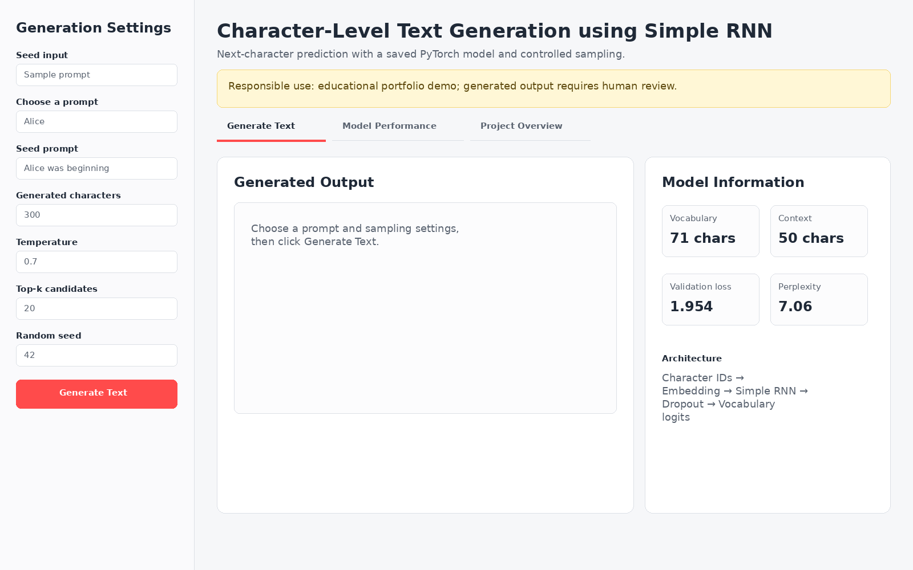
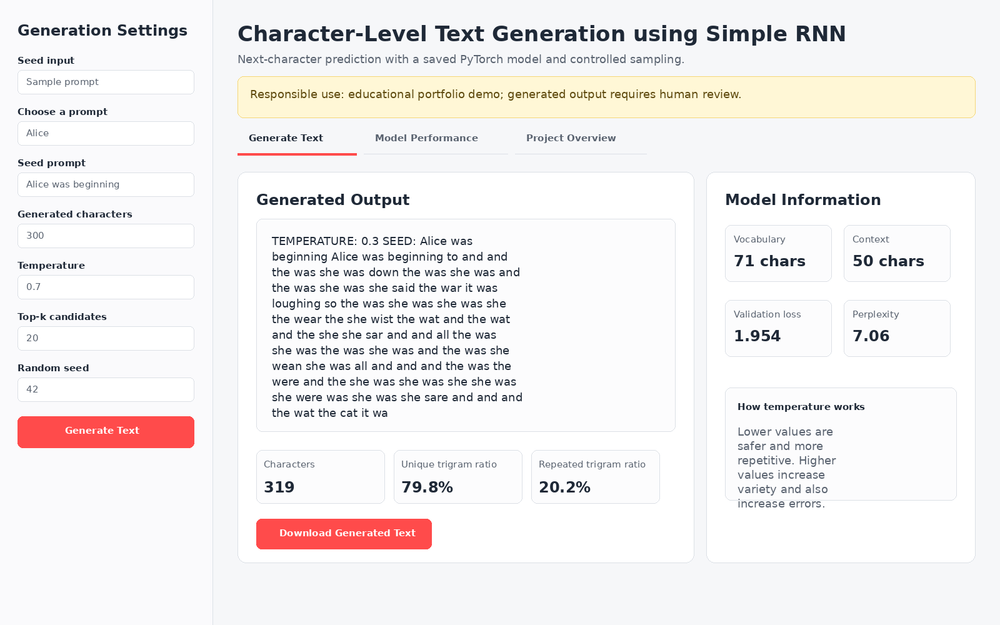
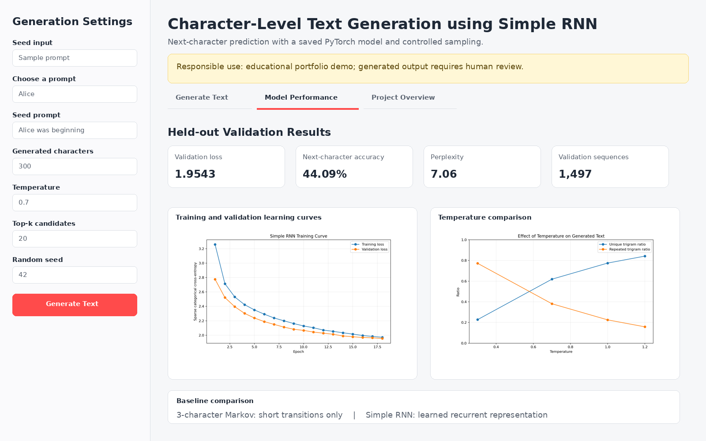
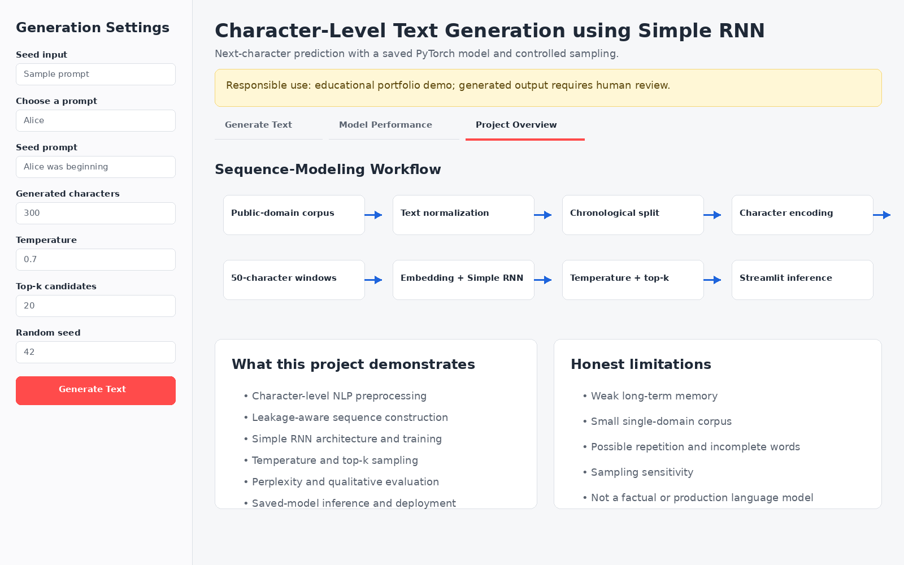

# Character-Level Text Generation using Simple RNN

[](https://www.python.org/)
[](https://pytorch.org/)
[](https://simple-rnn-projects-72u2s8vhngrexwwgbjpy6r.streamlit.app/)
[](../LICENSE)
[](https://github.com/unit-mole/simple-rnn-projects/actions/workflows/text-generation-rnn-ci.yml)

An end-to-end NLP and generative sequence-modeling project that uses a **character-level Simple Recurrent Neural Network** to predict the next character and generate new text from a seed prompt. The project includes leakage-aware preprocessing, reusable training and inference modules, a saved PyTorch model, quantitative and qualitative evaluation, automated tests, GitHub Actions CI, and an interactive Streamlit application.

**Status:** Portfolio-ready and deployed  
**Live demo:** [Open the Streamlit application](https://simple-rnn-projects-72u2s8vhngrexwwgbjpy6r.streamlit.app/)  
[](https://simple-rnn-projects-72u2s8vhngrexwwgbjpy6r.streamlit.app/)  
**Primary stack:** Python · PyTorch · NumPy · pandas · Matplotlib · Streamlit · pytest

> **Responsible use:** This project is for educational and portfolio demonstration purposes only. Generated text may be inaccurate, repetitive, biased, or nonsensical. Do not use it to create harmful, misleading, private, sensitive, or high-stakes content. Human review is required before using any output.

---

## NLP Problem

A text generator must learn how characters depend on preceding characters and use those learned sequential patterns to predict what is likely to come next.

This project answers:

> Given a seed prompt, can a Simple RNN generate new text that follows character patterns learned from a public-domain training corpus?

The application produces:

- **Seed prompt**
- **Generated text**
- **Generation length**
- **Temperature setting**
- **Top-k sampling setting**
- **Generation-quality indicators**
- **Model and limitation interpretation**

The model is not a search engine or a large language model. It learns statistical patterns from a compact text corpus and generates one character at a time.

---

## Project Highlights

- End-to-end character-level text-generation workflow
- Unicode and whitespace normalization without destructive over-cleaning
- Chronological train-validation split before overlapping windows are created
- Integer-encoded character sequences instead of memory-heavy one-hot tensors
- Embedding layer followed by a PyTorch `nn.RNN` Simple RNN
- Cross-entropy training with Adam, gradient clipping, validation monitoring, and early stopping
- Saved model, vocabulary, training configuration, and model metadata
- Temperature, top-k, and reproducible random-seed sampling
- Perplexity, next-character accuracy, generated-text metrics, and qualitative analysis
- Three-character Markov baseline comparison
- Streamlit application that loads the saved model without retraining
- Automated tests, project validation, and GitHub Actions CI
- Responsible-use guidance and an honest limitation statement

---

## Application Preview

The preview images below mirror the layout and content of the included Streamlit application.

### 1. Text-generation interface

Users can choose a sample prompt or enter a custom seed, control generation length, temperature, top-k sampling, and the random seed, and then download the generated output.



### 2. Generated-text result

The application generates text one character at a time and reports simple repetition and diversity indicators for qualitative review.



### 3. Model-performance dashboard

The performance tab displays validation loss, next-character accuracy, perplexity, learning curves, temperature analysis, and the Markov baseline comparison.



### 4. Project-overview tab

The overview tab explains the complete sequence-modeling workflow, portfolio skills, and honest project limitations.



---

## Project Status and Honest Scope

This is a complete, deployable portfolio project rebuilt from the supplied notebook and Streamlit prototype. The underlying task is **character-level next-character prediction**, not word-level generation or a Transformer-based language model.

The project is suitable for demonstrating:

- NLP preprocessing
- Sequential data preparation
- Simple RNN architecture design
- Model training and evaluation
- Autoregressive text generation
- Sampling controls
- Saved-model inference
- Testing, CI/CD, and deployment

The model should not be presented as production-grade generative AI. Its compact public-domain corpus and Simple RNN architecture limit long-range context, factuality, grammar, and domain generalization.

---

## Dataset

The included corpus is a compact public-domain excerpt from **Alice's Adventures in Wonderland** by Lewis Carroll. It is stored as plain UTF-8 text in [`data/sample_text.txt`](data/sample_text.txt).

| Dataset detail | Value |
|---|---:|
| Data format | Plain text |
| Corpus characters | 45,382 |
| Training characters | 40,843 |
| Validation characters | 4,539 |
| Personal or private data | None |
| Redistribution approach | Compact public-domain sample |

The repository also includes [`data/sample_prompts.csv`](data/sample_prompts.csv) for demonstration prompts.

See [`data/README_data.md`](data/README_data.md) for corpus source, usage guidance, and instructions for replacing the text safely.

---

## Text Preprocessing

The preprocessing pipeline intentionally preserves useful writing structure:

- Normalize Unicode with NFKC
- Standardize Windows and legacy line endings
- Replace tab characters with spaces
- Reduce repeated spaces
- Reduce excessive blank lines
- Preserve capitalization
- Preserve punctuation and quotation marks
- Preserve paragraph boundaries
- Fit the character vocabulary on the training segment
- Map unseen validation or prompt characters to an unknown token

Character-level generation benefits from punctuation, capitalization, and newlines. Removing these signals would simplify the corpus but reduce the model's ability to learn realistic text structure.

---

## Sequence Generation and Leakage Control

This project uses a **character-level next-character prediction** setup.

```text
Input:  50 consecutive character IDs
Target: The immediately following character ID
Step:   Advance 3 characters before creating the next window
```

The corpus is divided chronologically before sequence windows are created:

```text
Complete corpus
    ├── First 90% → training text → training windows
    └── Final 10% → validation text → validation windows
```

This approach prevents highly similar overlapping windows from being randomly distributed across both training and validation sets. The model is therefore evaluated on a later, held-out segment of the corpus.

---

## Technical Workflow

1. Load the UTF-8 public-domain text corpus.
2. Normalize Unicode and whitespace while retaining punctuation and capitalization.
3. Split the text chronologically into training and validation segments.
4. Fit the character vocabulary using the training segment.
5. Convert characters into integer IDs.
6. Create fixed-length input windows and next-character targets.
7. Train an Embedding → Simple RNN → Dropout → Dense model.
8. Monitor training loss, validation loss, accuracy, and early stopping.
9. Save the best model checkpoint, vocabulary, configuration, and metadata.
10. Calculate validation loss, accuracy, and perplexity.
11. Generate samples at multiple temperature settings.
12. Compare the Simple RNN with a Markov baseline.
13. Serve saved-model inference through Streamlit.
14. Validate the project through pytest, a project-validation script, and GitHub Actions.

---

## Simple RNN Architecture

```text
Integer character sequence: 50 characters
                ↓
Embedding layer: 32 dimensions
                ↓
Simple RNN: 64 hidden units, tanh activation
                ↓
Dropout: 0.20
                ↓
Dense output: 71 character logits
                ↓
Softmax applied during sampling
                ↓
Next-character prediction
```

### Training configuration

| Parameter | Value |
|---|---:|
| Sequence length | 50 |
| Sequence step | 3 |
| Validation fraction | 10% |
| Embedding dimension | 32 |
| Simple RNN units | 64 |
| Dropout | 0.20 |
| Batch size | 256 |
| Maximum epochs | 18 |
| Learning rate | 0.002 |
| Optimizer | Adam |
| Loss | Cross-entropy |
| Gradient clipping | 1.0 |
| Random seed | 42 |

The Simple RNN remains the primary model because this project belongs to the Simple RNN portfolio series. LSTM, GRU, and Transformer models are discussed only as future comparisons.

---

## Text Generation and Sampling

The trained network predicts a distribution over the complete character vocabulary. Generation is autoregressive: each sampled character is appended to the context and becomes part of the next prediction window.

The reusable generator supports:

- Custom seed prompt
- Generation length from 1 to 5,000 characters in code
- Temperature sampling
- Top-k filtering
- Reproducible random seed
- Optional inclusion of the original seed in output

### Temperature interpretation

| Temperature | Typical behavior |
|---|---|
| `0.3` | Predictable, conservative, and often repetitive |
| `0.7` | Better balance between local structure and variety |
| `1.0` | More diverse but less stable |
| `1.2` | Highly random and more error-prone |

Lower temperature concentrates probability on likely characters. Higher temperature flattens the distribution and increases the chance of lower-probability characters.

### Top-k interpretation

Top-k sampling restricts each prediction to the `k` most likely characters. This helps prevent extreme low-probability choices while preserving controlled variation.

---

## Model Results

The included model was evaluated on the chronological validation segment.

| Metric | Result |
|---|---:|
| Corpus characters | 45,382 |
| Training sequences | 13,598 |
| Validation sequences | 1,497 |
| Vocabulary size | 71 |
| Validation loss | **1.9543** |
| Validation next-character accuracy | **44.09%** |
| Validation perplexity | **7.06** |

### Metric interpretation

- **Cross-entropy loss** evaluates how much probability the model assigns to the correct next character.
- **Next-character accuracy** is the percentage of validation windows where the highest-probability character is correct.
- **Perplexity** is the exponential of average cross-entropy loss; lower values indicate a more concentrated and accurate next-character distribution.
- **Generated samples** reveal repetition, spelling-like structure, punctuation behavior, and practical readability.
- **Temperature comparison** shows how sampling configuration changes diversity and stability.

Text generation should never be evaluated from a single classification-style metric. Quantitative evaluation and human review are both required.

---

## Baseline Comparison

The project includes a three-character Markov baseline.

| Model | What it learns | Main limitation |
|---|---|---|
| Three-character Markov baseline | Short local character transitions | No learned hidden representation or longer context |
| Simple RNN | A recurrent representation of the preceding character sequence | Weak long-term memory compared with LSTM, GRU, and Transformers |

The baseline comparison is educational rather than a claim of universal superiority. It shows the difference between memorized local transitions and a learned recurrent state.

Generated samples are available in [`outputs/generated_text_samples.txt`](outputs/generated_text_samples.txt), while the baseline table is available in [`outputs/baseline_comparison.csv`](outputs/baseline_comparison.csv).

---

## Streamlit Application

The application supports:

- Sample seed-prompt selection
- Custom seed-prompt entry
- Generated-character length control
- Temperature control
- Top-k control
- Random-seed control
- Pre-trained model loading through `st.cache_resource`
- Downloadable generated text
- Vocabulary, sequence length, validation loss, and perplexity display
- Learning-curve and temperature-analysis plots
- Baseline-comparison table
- Project workflow and limitation explanation
- Responsible-use warning

The app does not retrain the model during startup or when the user clicks Generate.

---

## Project Structure

```text
simple-rnn-projects/
├── .github/
│   └── workflows/
│       └── text-generation-rnn-ci.yml
│
└── 05-text-generation/
    ├── app/
    │   ├── streamlit_app.py
    │   └── requirements.txt
    ├── data/
    │   ├── README_data.md
    │   ├── sample_prompts.csv
    │   └── sample_text.txt
    ├── images/
    │   ├── 01_text_generation_interface.png
    │   ├── 02_generated_text_result.png
    │   ├── 03_model_performance_dashboard.png
    │   ├── 04_project_overview.png
    │   └── README.md
    ├── models/
    │   ├── text_generation_simple_rnn_model.pt
    │   ├── vocabulary.json
    │   ├── training_config.json
    │   ├── model_metadata.json
    │   └── MODEL_CARD.md
    ├── notebooks/
    │   ├── text_generation.ipynb
    │   └── archive/
    │       └── text_generation_original.ipynb
    ├── outputs/
    │   ├── baseline_comparison.csv
    │   ├── generated_text_samples.txt
    │   ├── model_metrics.json
    │   ├── sequence_length_summary.png
    │   ├── temperature_comparison.png
    │   ├── temperature_generation_metrics.csv
    │   ├── training_curve.png
    │   └── training_history.csv
    ├── src/
    │   ├── __init__.py
    │   ├── data_preprocessing.py
    │   ├── model_evaluation.py
    │   ├── model_training.py
    │   ├── sequence_generation.py
    │   ├── text_generator.py
    │   ├── text_preprocessing.py
    │   └── visualization.py
    ├── tests/
    │   ├── test_generation.py
    │   ├── test_model_loading.py
    │   └── test_preprocessing.py
    ├── .streamlit/
    │   └── config.toml
    ├── .gitignore
    ├── .python-version
    ├── PROJECT_REVIEW.md
    ├── README.md
    ├── README_HOSTING.md
    ├── VALIDATION_REPORT.json
    ├── requirements.txt
    ├── requirements-ci.txt
    ├── run_app.bat
    ├── train_model.py
    └── validate_project.py
```

The local `.pytest_cache/` directory may appear after tests run. It is intentionally excluded from Git because it is a temporary pytest cache, not a project artifact.

---

## Run Locally

Use Python 3.12 to match the CI and recommended deployment environment.

### Windows Command Prompt

Clone the repository and enter the project folder:

```bat
git clone https://github.com/unit-mole/simple-rnn-projects.git

cd simple-rnn-projects\05-text-generation
```

Create the virtual environment in a short Windows path. This avoids Windows path-length errors when the repository is stored inside a deeply nested OneDrive folder:

```bat
if not exist "C:\venvs" mkdir "C:\venvs"

python -m venv "C:\venvs\textgen"

call "C:\venvs\textgen\Scripts\activate.bat"
```

Confirm that the activated interpreter is being used:

```bat
where python

python --version
```

Install the application and test dependencies:

```bat
python -m pip install --upgrade pip setuptools wheel

python -m pip install -r requirements.txt -r requirements-ci.txt
```

Run automated tests:

```bat
python -m pytest -q
```

Run the complete project validation:

```bat
python validate_project.py
```

Launch Streamlit:

```bat
python -m streamlit run app\streamlit_app.py
```

You can also double-click:

```text
run_app.bat
```

Open the local URL shown by Streamlit, normally:

```text
http://localhost:8501
```

### Future Windows runs

After the first installation, use:

```bat
cd simple-rnn-projects\05-text-generation

call "C:\venvs\textgen\Scripts\activate.bat"

python -m streamlit run app\streamlit_app.py
```

### macOS or Linux

```bash
git clone https://github.com/unit-mole/simple-rnn-projects.git
cd simple-rnn-projects/05-text-generation
python3.12 -m venv .venv
source .venv/bin/activate
python -m pip install --upgrade pip setuptools wheel
python -m pip install -r requirements.txt -r requirements-ci.txt
python -m pytest -q
python validate_project.py
python -m streamlit run app/streamlit_app.py
```

---

## Optional Retraining

The included Streamlit application works with the committed model and does not require retraining.

To rebuild the saved model and evaluation artifacts:

```bash
python train_model.py
```

Optional settings:

```bash
python train_model.py \
  --corpus data/sample_text.txt \
  --epochs 18 \
  --sequence-length 50 \
  --step 3
```

Retraining updates:

- `models/text_generation_simple_rnn_model.pt`
- `models/vocabulary.json`
- `models/training_config.json`
- `models/model_metadata.json`
- `outputs/training_history.csv`
- `outputs/model_metrics.json`
- `outputs/generated_text_samples.txt`
- Evaluation plots and baseline outputs

Run `python validate_project.py` after retraining to confirm artifact consistency and inference readiness.

---

## Automated Testing and CI/CD

The project includes tests for:

- Unicode and whitespace normalization
- Chronological splitting
- Vocabulary encoding and unknown-character handling
- Sequence-window preparation
- Deterministic sampling
- Temperature validation
- Seed-context preparation
- Saved-model loading and inference

The workflow is stored at:

```text
.github/workflows/text-generation-rnn-ci.yml
```

The GitHub Actions workflow runs when the text-generation project or its workflow file changes. It:

1. Checks out the repository.
2. Configures Python 3.12.
3. Installs project and CI dependencies.
4. Compiles Python files.
5. Runs pytest.
6. Runs the saved-model and project-artifact validation.

---

## Deployment

The application is deployed on **Streamlit Community Cloud** and connected directly to the `main` branch of this GitHub repository. The deployed app loads the committed Simple RNN model and supporting vocabulary artifacts; retraining is not performed during startup.

**Live application:**  
[Open the Character-Level Text Generation application](https://simple-rnn-projects-72u2s8vhngrexwwgbjpy6r.streamlit.app/)

**Streamlit entrypoint:**

```text
05-text-generation/app/streamlit_app.py
```

Changes pushed to the relevant project files on the `main` branch automatically trigger a Streamlit application update.

See [`README_HOSTING.md`](README_HOSTING.md) for complete deployment configuration, maintenance instructions, and troubleshooting guidance.

---

## Data and Repository Safety

- The included corpus is a compact public-domain text sample.
- No private or personal data is included.
- Large, private, copyrighted, or unapproved corpora should not be committed.
- Local virtual environments, caches, secrets, logs, and raw private data are excluded through `.gitignore`.
- Streamlit secrets and `.env` files must not be committed.
- The compact model artifacts under `models/` are required for hosted inference and should remain in Git.
- Temporary `.pytest_cache/`, `__pycache__/`, and notebook-checkpoint folders are excluded.

---

## Known Limitations

- Simple RNNs struggle with long-term dependencies.
- The corpus is compact and represents a single literary writing domain.
- Character-level generation may create incomplete or misspelled words.
- Generated text can contain repetition, punctuation errors, and incomplete sentences.
- Low temperatures can produce repetitive output.
- High temperatures can produce unstable or incoherent output.
- Validation accuracy measures next-character prediction rather than factuality or writing quality.
- The model may reproduce patterns or fragments from its training corpus.
- The project does not provide bias, toxicity, factuality, or safety filtering.
- LSTM, GRU, and Transformer architectures generally model longer context more effectively.

---

## Future Improvements

- Compare Simple RNN, LSTM, and GRU using the same data split and evaluation approach
- Add a separate word-level text-generation experiment
- Increase the public-domain training corpus while respecting repository size
- Add nucleus sampling and beam-search experiments
- Add checkpoint versioning and experiment tracking
- Add TensorBoard, MLflow, or Weights & Biases integration
- Add automated quality and repetition reports for generated samples
- Add Docker deployment support
- Add model and data drift checks for a maintained public demo
- Add controlled content filters and stronger responsible-AI safeguards

---

## Skills Demonstrated

`Natural Language Processing` · `Text Preprocessing` · `Character Tokenization` · `Sequence Generation` · `Data Leakage Prevention` · `Simple Recurrent Neural Networks` · `PyTorch` · `Embedding Layers` · `Next-Character Prediction` · `Autoregressive Generation` · `Temperature Sampling` · `Top-k Sampling` · `Perplexity` · `Baseline Comparison` · `Model Evaluation` · `Modular Python` · `pytest` · `GitHub Actions` · `CI/CD` · `Streamlit` · `Model Deployment` · `Responsible AI Communication`

---

## Portfolio Description

**One-line description**

> Built and deployed a character-level Simple RNN that learns sequential writing patterns from a public-domain corpus and generates text using temperature and top-k sampling.

**Pinned-repository description**

> End-to-end character-level text-generation project featuring leakage-aware sequence preparation, PyTorch Simple RNN training, perplexity and qualitative evaluation, Markov baseline comparison, testing, CI/CD, and Streamlit deployment.

**Resume bullet**

> Developed an end-to-end character-level text-generation pipeline using a PyTorch Simple RNN, including chronological validation, saved inference artifacts, perplexity analysis, temperature and top-k sampling, automated tests, GitHub Actions, and Streamlit deployment.

**Connection to professional transition**

This project supports a transition from Quality Data Scientist to Data Science, Machine Learning, and Applied AI roles by demonstrating the ability to move beyond descriptive analytics and build a complete NLP system covering data preparation, neural-network training, evaluation, software engineering, deployment, and responsible communication.

---

## Author

**Anmol Tripathi**  
Quality Data Scientist | Data Science | Machine Learning | Applied AI | Analytics
