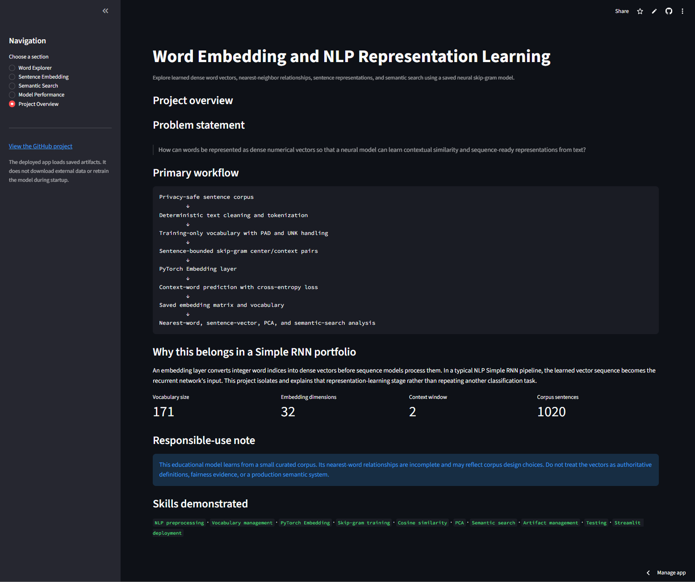
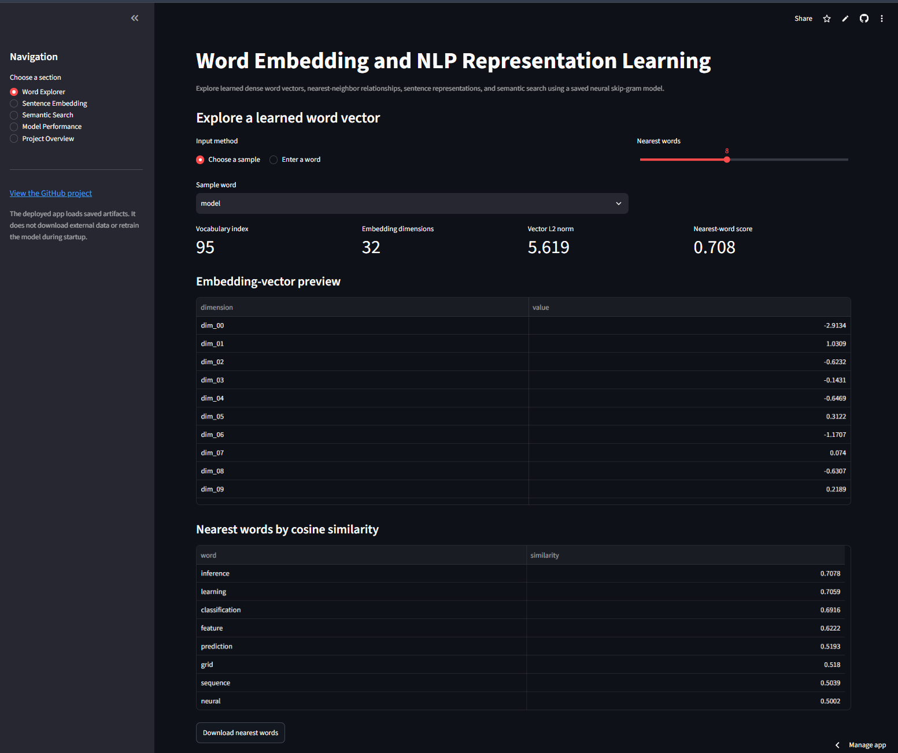
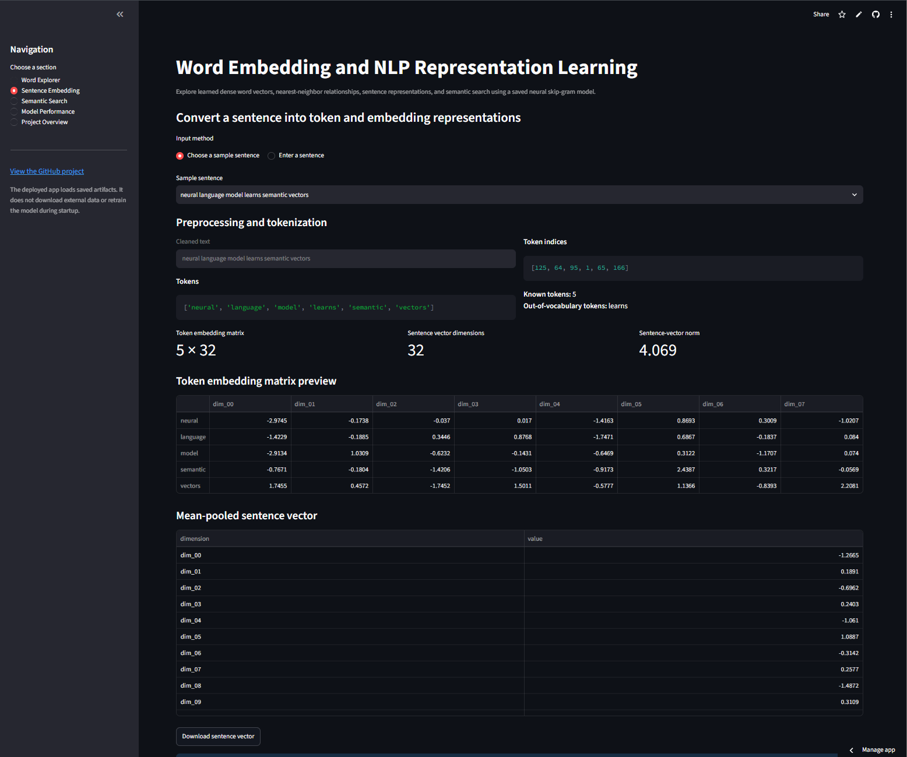
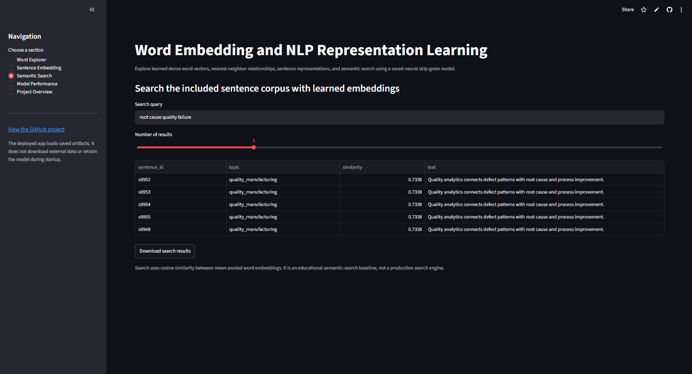
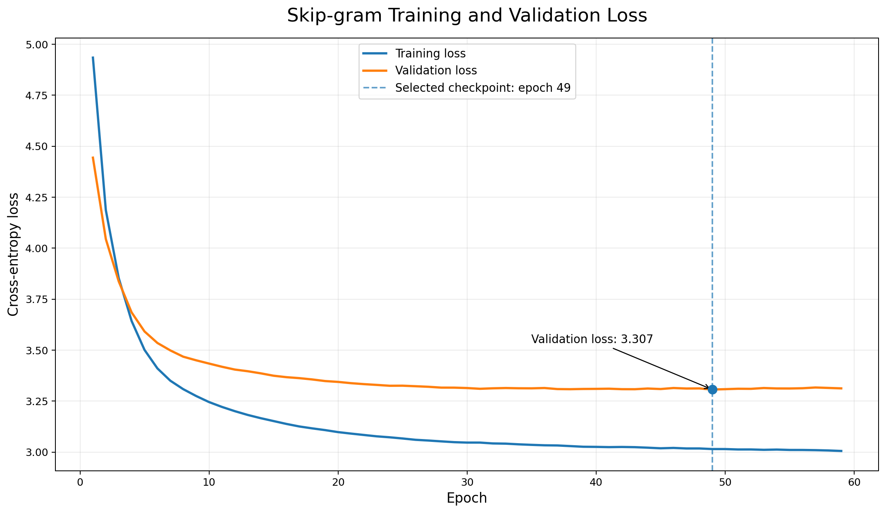
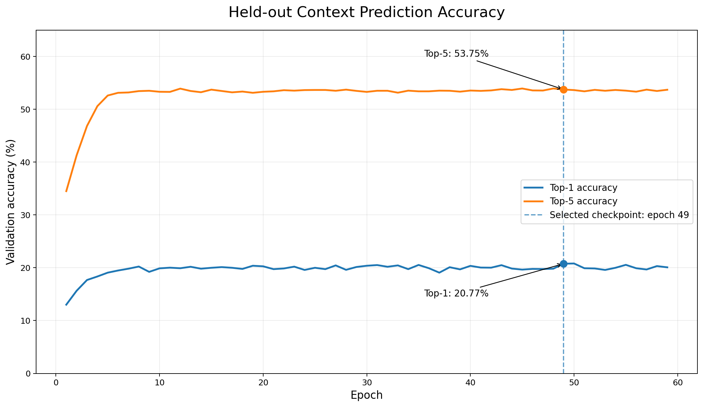
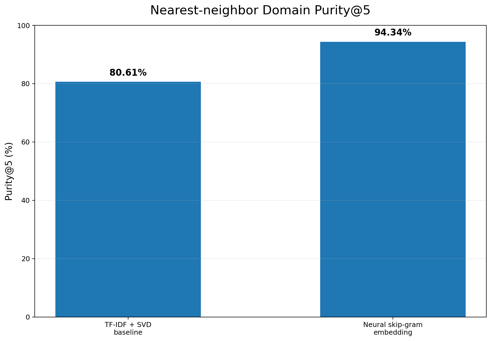
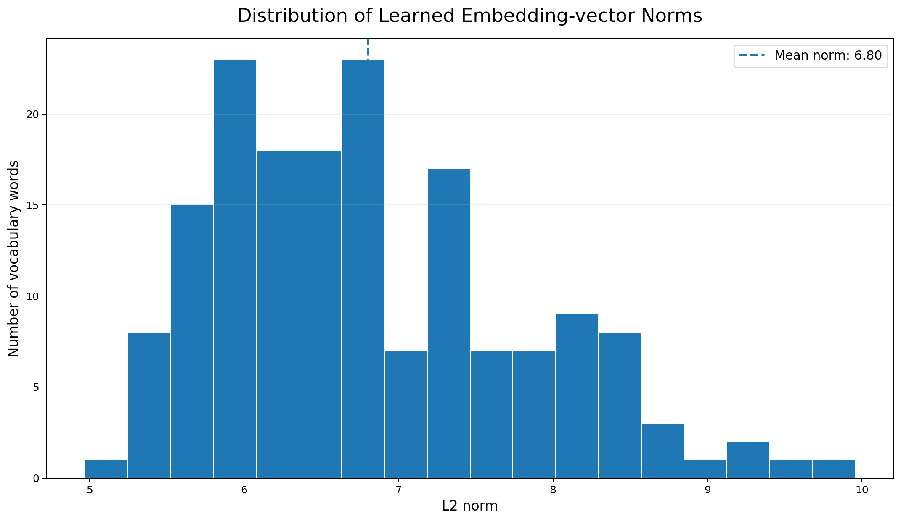
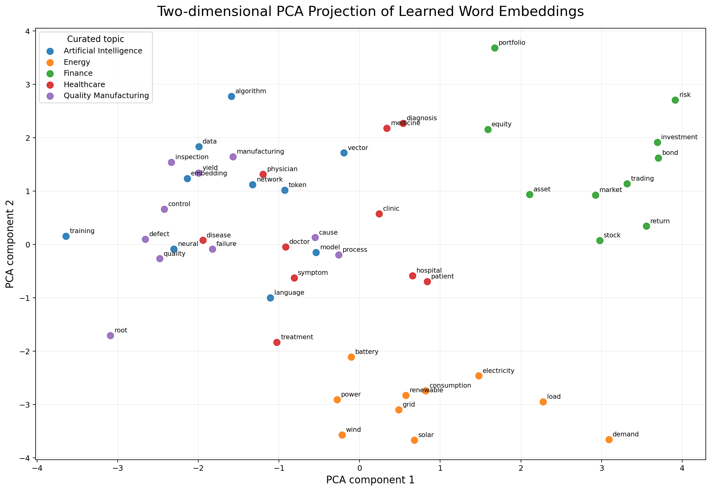

# Word Embedding and NLP Representation Learning

[](https://www.python.org/)
[](https://pytorch.org/)
[](https://simple-rnn-projects-kgg7njs6sltnwqqvmjirvm.streamlit.app/)
[](../LICENSE)
[](https://github.com/unit-mole/simple-rnn-projects/actions/workflows/word-embedding-rnn-ci.yml?query=branch%3Amain+event%3Apush)

An end-to-end NLP representation-learning project that converts words into dense numerical vectors using a neural skip-gram model. The project combines deterministic text preprocessing, vocabulary management, sentence-bounded context generation, PyTorch embedding training, nearest-word analysis, sentence-vector construction, semantic search, PCA visualization, baseline comparison, automated testing, and Streamlit deployment.

**Status:** Portfolio-ready and deployed  
**Live demo:** [Open the Word Embedding application](https://simple-rnn-projects-kgg7njs6sltnwqqvmjirvm.streamlit.app/)  
[](https://simple-rnn-projects-kgg7njs6sltnwqqvmjirvm.streamlit.app/)  
**Primary stack:** Python · PyTorch · scikit-learn · pandas · NumPy · Matplotlib · Streamlit

---

## NLP Problem

Raw words cannot be passed directly into a neural network. One-hot vectors give every word a separate sparse position, but they do not communicate whether two words are contextually related.

This project answers:

> How can words be represented as dense numerical vectors so that a neural model can learn contextual similarity and create sequence-ready representations from text?

The application produces:

- **Cleaned and tokenized text**
- **Integer word indices**
- **32-dimensional learned word vectors**
- **Nearest words using cosine similarity**
- **Token-by-embedding matrices**
- **Mean-pooled sentence vectors**
- **Embedding-based semantic-search results**
- **Two-dimensional PCA visualizations**

---

## Project Highlights

- Neural skip-gram training with a PyTorch `Embedding` layer
- 32-dimensional dense vector representation for each vocabulary item
- Sentence-bounded center/context pair generation
- Stable `<PAD>` and `<UNK>` handling
- Deterministic training and validation split of skip-gram pairs
- Early stopping based on validation loss
- TF-IDF + Truncated SVD recreation of the supplied method as an LSA baseline
- Nearest-word lookup using cosine similarity
- Sentence tokenization, integer mapping, and embedding-matrix inspection
- Mean-pooled sentence representations and lightweight semantic search
- PCA-based embedding visualization
- Saved model, vocabulary, embedding matrix, metadata, configuration, and checksums
- Modular source code, tests, GitHub Actions CI, and Streamlit deployment

---

## Application Preview

The screenshots below were captured directly from the deployed Streamlit application and show the main user workflows.

### 1. Application overview

The overview introduces the representation-learning objective, the neural skip-gram workflow, the saved-model scope, and the available application sections.



### 2. Word Explorer results

The Word Explorer displays the selected word's vocabulary index, embedding-vector preview, nearest neighbors by cosine similarity, and a local two-dimensional neighborhood visualization.



### 3. Sentence embedding analysis

The sentence-analysis workflow shows cleaned text, tokens, integer indices, known and out-of-vocabulary words, the token-by-embedding matrix shape, and the mean-pooled sentence vector.



### 4. Semantic-search results

The semantic-search workflow converts the query into a sentence vector and ranks the included sentences by cosine similarity, with results available for download.



---

## Project Status and Honest Scope

This is a complete, deployable educational portfolio prototype built from the supplied notebook and application code. The primary model learns embeddings from a small **synthetic and privacy-safe** corpus organized around five domains.

The project is suitable for demonstrating NLP preprocessing, neural representation learning, embedding evaluation, reusable inference, testing, and deployment. It is not a general-purpose language model, a production semantic-search system, or a substitute for large pretrained Word2Vec, GloVe, FastText, or transformer embeddings.

The supplied project used TF-IDF followed by Truncated SVD to create dense term and document vectors. That method is retained as a documented **Latent Semantic Analysis baseline**. The improved project adds a genuine neural `Embedding` layer trained through a full-softmax skip-gram context-prediction objective.

---

## Dataset

The included privacy-safe corpus contains **1,020 synthetic sentences** and **9,306 processed tokens**.

| Dataset detail | Value |
|---|---:|
| Corpus sentences | 1,020 |
| Processed tokens | 9,306 |
| Curated domains | 5 |
| Vocabulary size | 171 |
| Personal or employer data | None |
| External download required by deployed app | No |

The five domains are:

- Artificial Intelligence
- Finance
- Healthcare
- Energy
- Quality and Manufacturing

The corpus was constructed from the themes already present in the supplied notebook and expanded into a deterministic educational dataset. See [`data/README_data.md`](data/README_data.md) for data provenance and repository-safety guidance.

An optional local loader for selected 20 Newsgroups categories is provided for experimentation. That external corpus is not redistributed and is not downloaded by the deployed application.

---

## Text Preprocessing

The preprocessing pipeline applies:

1. HTML entity decoding and tag removal
2. URL and email removal
3. Lowercasing
4. Alphabetic token extraction
5. Extra-whitespace normalization
6. Minimum-frequency filtering
7. Stable `<PAD>` and `<UNK>` indices
8. Saved word-to-index mapping

Punctuation and capitalization are removed because this project focuses on word-level contextual co-occurrence rather than authorship style or character-level generation.

---

## Vocabulary and Tokenization

The saved vocabulary contains **171 entries**, including two special tokens:

```text
<PAD> → 0
<UNK> → 1
frequent corpus words → 2 ... 170
```

A sentence such as:

```text
quality inspection finds a manufacturing defect
```

is processed as:

```text
Raw sentence
    ↓
Cleaned tokens
    ↓
Integer word indices
    ↓
Number of tokens × 32 embedding matrix
```

Unknown words map to `<UNK>` so inference remains stable when unseen text is entered.

---

## Technical Workflow

1. Load the included privacy-safe text corpus.
2. Clean and tokenize each sentence.
3. Build the training-only vocabulary with `<PAD>` and `<UNK>` entries.
4. Create sentence-bounded center/context pairs using a two-word context window.
5. Split the skip-gram pairs into training and validation sets.
6. Train the PyTorch embedding model using cross-entropy loss and Adam optimization.
7. Select the best checkpoint using validation loss and early stopping.
8. Extract and save the learned embedding matrix.
9. Evaluate context prediction using loss, perplexity, top-1 accuracy, and top-5 accuracy.
10. Evaluate nearest-neighbor domain purity on the curated vocabulary.
11. Rebuild the original TF-IDF + SVD method as a baseline.
12. Generate similarity tables, PCA outputs, sentence analyses, and semantic-search examples.
13. Serve saved artifacts through Streamlit without retraining at startup.

---

## Neural Embedding Architecture

The primary PyTorch model contains **11,115 trainable parameters**.

```text
Center-word index
        ↓
Embedding layer: 171 vocabulary entries × 32 dimensions
        ↓
Dense projection: 32 → 171
        ↓
Softmax context-word distribution
        ↓
Predicted surrounding word
```

The model uses:

- PyTorch `nn.Embedding`
- PyTorch `nn.Linear`
- full-vocabulary softmax prediction
- cross-entropy loss
- Adam optimization
- context-window size of two words on each side
- validation-based early stopping

The learned embedding matrix has shape:

```text
171 × 32
```

A 32-dimensional embedding was selected because it is expressive enough to demonstrate contextual grouping while remaining lightweight for a small educational corpus and cloud deployment.

---

## Representation Baseline

The supplied application used TF-IDF and Truncated SVD:

```text
Text corpus
    ↓
Sparse TF-IDF document matrix
    ↓
Truncated SVD
    ↓
Dense term and document vectors
```

This is a useful Latent Semantic Analysis baseline, but it is not a neural embedding model. The improved project keeps the baseline so the portfolio demonstrates the difference between classical sparse-to-dense projection and learned neural context representations.

| Representation | Vector type | Semantic relationship | Word order | Portfolio role |
|---|---|---|---|---|
| One-hot encoding | Sparse | None | No | Conceptual baseline |
| Bag-of-Words | Sparse | Frequency only | No | Count baseline |
| TF-IDF | Sparse | Weighted document importance | No | Weighted baseline |
| TF-IDF + SVD | Dense | Latent document co-occurrence | No | Supplied-project baseline |
| Neural skip-gram | Dense | Learned local context | Context-window based | Primary model |

---

## Saved-Model Results

| Task | Metric | Result |
|---|---|---:|
| Context prediction | Validation loss | **3.3070** |
| Context prediction | Validation perplexity | **27.30** |
| Context prediction | Top-1 accuracy | **20.77%** |
| Context prediction | Top-5 accuracy | **53.75%** |
| Embedding analysis | Neural domain purity@5 | **94.34%** |
| Baseline analysis | TF-IDF + SVD domain purity@5 | **80.61%** |

### Metric interpretation

- **Validation loss** measures held-out context-word prediction error.
- **Perplexity** is the exponential of validation loss and summarizes prediction uncertainty.
- **Top-1 accuracy** checks whether the highest-scoring word is the true context word.
- **Top-5 accuracy** checks whether the true context word appears among the five highest-scoring predictions.
- **Domain purity@5** measures the proportion of five nearest neighbors that share the curated domain of the query word.
- **PCA and nearest-word examples** provide qualitative evidence of grouping and neighborhood structure.

Domain purity is an internal diagnostic created for this controlled corpus. It is not a standard open-domain benchmark and should not be interpreted as proof of broad language understanding.

---

## Model-Performance Analysis

### Training and validation loss

Training loss continued to decline while validation loss stabilized. The selected checkpoint corresponds to the minimum validation loss before early stopping.



### Held-out context-prediction accuracy

Top-5 accuracy is substantially higher than top-1 accuracy because several nearby context words may be plausible for the same center word. The selected checkpoint achieved **20.77% top-1 accuracy** and **53.75% top-5 accuracy**.



### Neural embedding versus LSA baseline

The neural skip-gram representation achieved higher curated domain purity than the recreated TF-IDF + SVD baseline.



### Embedding-vector norm distribution

The vector-norm distribution helps detect collapsed, near-zero, or unusually large embedding vectors. The learned vocabulary shows a reasonable spread rather than identical vector magnitudes.



### Two-dimensional embedding projection

PCA compresses the 32-dimensional vectors into two dimensions for visualization. Words from the same curated topic often appear in nearby regions, although two-dimensional projection can distort true high-dimensional distances.



---

## Example Learned Relationships

Examples generated from the saved neural embedding matrix include:

```text
model → inference, learning, classification, feature, prediction
market → investor, volatility, bond, security, risk
electricity → renewable, energy, consumption, carbon, grid
quality → defect, failure, inspection, manufacturing, improvement
```

Exact neighbor ordering may change after retraining.

---

## Sentence Representation

For an input sentence, the application displays:

- cleaned text;
- token list;
- integer indices;
- known and out-of-vocabulary words;
- token embedding-matrix shape;
- vector preview; and
- mean-pooled sentence vector.

The sentence baseline is:

```text
sentence vector = mean of known word vectors
```

Mean pooling is transparent and efficient, but it loses word order. A Simple RNN would instead consume the embedding vectors sequentially and update a recurrent hidden state.

---

## Why This Project Belongs in the Simple RNN Portfolio

An embedding layer is the representation stage used before a recurrent network processes token sequences.

```text
Raw text
   ↓
Tokenizer
   ↓
Integer sequence
   ↓
Embedding vectors
   ↓
Simple RNN
   ↓
Task-specific output
```

The IMDb and SMS projects demonstrate complete Simple RNN classification pipelines. This project isolates and explains the embedding stage so the portfolio clearly shows what a recurrent model receives as input rather than repeating another text classifier.

---

## Streamlit Application

The deployed application supports:

### Word Explorer

- select or enter a vocabulary word;
- inspect its index and embedding-vector preview;
- retrieve nearest words using cosine similarity;
- visualize the local embedding neighborhood; and
- download similarity results.

### Sentence Embedding

- clean and tokenize an input sentence;
- display token indices and OOV words;
- inspect the token-by-embedding matrix;
- create a mean-pooled sentence representation; and
- download the sentence vector.

### Semantic Search

- convert a query into a sentence vector;
- compare it with included sentence representations;
- rank results using cosine similarity; and
- download the ranked table.

### Model Performance

- review validation metrics;
- compare the neural model with the LSA baseline;
- inspect training behavior;
- examine embedding-vector norms; and
- review the PCA projection.

### Project Overview

- understand the model workflow;
- review artifact information;
- read responsible-use guidance; and
- inspect the portfolio skills demonstrated.

The app loads committed artifacts and does not retrain or download external data during startup.

---

## Project Structure

```text
simple-rnn-projects/
├── .github/
│   └── workflows/
│       └── word-embedding-rnn-ci.yml
│
└── 06-word-embedding/
    ├── app/
    │   ├── streamlit_app.py
    │   ├── requirements.txt
    │   └── archive/
    │       └── word_embedding_streamlit_app_original.py
    ├── data/
    │   ├── README_data.md
    │   ├── sample_sentences.txt
    │   ├── sample_text.csv
    │   └── topic_lexicon.json
    ├── images/
    │   ├── 01_application_overview.png
    │   ├── 02_word_explorer_results.png
    │   ├── 03_sentence_embedding_analysis.png
    │   ├── 04_semantic_search_results.png
    │   ├── 05_training_validation_loss.png
    │   ├── 06_validation_context_accuracy.png
    │   ├── 07_domain_purity_comparison.png
    │   ├── 08_embedding_norm_distribution.png
    │   └── 09_embedding_visualization_2d.png
    ├── models/
    │   ├── word_embedding_model.pt
    │   ├── embedding_matrix.npy
    │   ├── vocabulary.json
    │   ├── model_metadata.json
    │   ├── training_config.json
    │   ├── artifact_checksums.json
    │   └── MODEL_CARD.md
    ├── notebooks/
    │   ├── word_embedding.ipynb
    │   └── archive/
    │       └── word_embedding_original.ipynb
    ├── outputs/
    │   ├── training_history.csv
    │   ├── model_metrics.json
    │   ├── embedding_projection_2d.csv
    │   ├── embedding_matrix_summary.json
    │   ├── word_similarity_examples.csv
    │   ├── semantic_search_examples.csv
    │   ├── sample_sentence_analysis.csv
    │   ├── domain_purity_details.csv
    │   ├── lsa_domain_purity_details.csv
    │   └── representation_comparison.csv
    ├── src/
    │   ├── __init__.py
    │   ├── baseline_representations.py
    │   ├── config.py
    │   ├── data_preprocessing.py
    │   ├── text_preprocessing.py
    │   ├── sequence_generation.py
    │   ├── embedding_training.py
    │   ├── embedding_analysis.py
    │   ├── embedding_pipeline.py
    │   ├── model_evaluation.py
    │   └── visualization.py
    ├── tests/
    │   ├── test_artifact_consistency.py
    │   ├── test_embedding_analysis.py
    │   ├── test_model_loading.py
    │   ├── test_sequence_generation.py
    │   └── test_text_preprocessing.py
    ├── .gitignore
    ├── .python-version
    ├── PROJECT_REVIEW.md
    ├── README.md
    ├── README_HOSTING.md
    ├── VALIDATION_REPORT.json
    ├── requirements.txt
    ├── requirements-ci.txt
    ├── run_app.bat
    ├── train_model.py
    └── validate_project.py
```

---

## Run Locally

Use Python 3.12 to match the tested local and deployment environments.

### Windows Command Prompt

Enter the project folder:

```bat
cd /d "C:\Users\atripathi\OneDrive - Veralto\Desktop\AI Codes\GIT Projects\simple-rnn-projects\06-word-embedding"
```

Create the virtual environment in a short path to avoid Windows path-length errors:

```bat
if not exist "C:\venvs" mkdir "C:\venvs"
python -m venv "C:\venvs\wordembed"
call "C:\venvs\wordembed\Scripts\activate.bat"
```

Install runtime and test dependencies:

```bat
python -m pip install --upgrade pip setuptools wheel
python -m pip install -r requirements.txt
python -m pip install -r requirements-ci.txt
```

Run automated tests and project validation:

```bat
python -m pytest -q
python validate_project.py
```

Launch the Streamlit application:

```bat
python -m streamlit run app\streamlit_app.py
```

Open the local URL displayed by Streamlit, normally:

```text
http://localhost:8501
```

### Future local runs

```bat
cd /d "C:\Users\atripathi\OneDrive - Veralto\Desktop\AI Codes\GIT Projects\simple-rnn-projects\06-word-embedding"
call "C:\venvs\wordembed\Scripts\activate.bat"
python -m streamlit run app\streamlit_app.py
```

---

## Optional Retraining

The included model runs without retraining.

To rebuild the saved artifacts from the included corpus:

```bat
python train_model.py
```

A configurable example is:

```bat
python train_model.py --embedding-dim 32 --window-size 2 --epochs 60 --batch-size 4096
```

Retraining overwrites artifacts in `models/` and regenerates evaluation files in `outputs/`. The optional 20 Newsgroups loader is intended only for governed local experimentation.

---

## Deployment

The application is deployed on Streamlit Community Cloud and connected to the `main` branch of this GitHub repository.

**Live application:**  
[Open the Word Embedding and NLP Representation Learning application](https://simple-rnn-projects-kgg7njs6sltnwqqvmjirvm.streamlit.app/)

**Streamlit entrypoint:**

```text
06-word-embedding/app/streamlit_app.py
```

**Deployment configuration:**

```text
Repository:      unit-mole/simple-rnn-projects
Branch:          main
Python version:  3.12
```

Changes pushed to the relevant project files on the `main` branch automatically trigger a Streamlit application update.

See [`README_HOSTING.md`](README_HOSTING.md) for deployment maintenance and troubleshooting instructions.

---

## Data and Repository Safety

- The included corpus is synthetic and privacy-safe.
- No employer, customer, health, authentication, or private-message data is included.
- External corpora are not downloaded by the deployed application.
- Local downloaded datasets, virtual environments, logs, temporary files, and secrets are excluded through `.gitignore`.
- Saved model artifacts are required for inference and should remain under `models/`.
- Licensing and privacy must be reviewed before adding any new corpus.

---

## Responsible Use

This project is for education and portfolio demonstration.

The learned relationships:

- depend on a small curated corpus;
- may be incomplete or misleading;
- may not generalize to new domains;
- should not be treated as dictionary definitions;
- should not be used as fairness evidence; and
- should not support high-impact decisions.

Human review is required before embedding outputs are used in any real workflow.

---

## Known Limitations

- Small synthetic vocabulary
- Static and context-independent word vectors
- Pair-level validation rather than sentence-level or corpus-level external evaluation
- Out-of-vocabulary words map to a single unknown token
- Mean-pooled sentence vectors lose word order
- PCA can distort high-dimensional neighborhoods
- Domain-purity evaluation is tailored to the curated dataset
- Skip-gram embeddings do not represent multiple meanings of the same word
- Results are not directly comparable with large pretrained embeddings

---

## Future Improvements

- Train on a larger governed public corpus
- Compare with pretrained GloVe, Word2Vec, and FastText vectors
- Add subword embeddings for rare and unseen words
- Evaluate on standard word-similarity datasets where licensing permits
- Add word-analogy evaluation
- Compare mean pooling with Simple RNN sentence representations
- Add sentence-level validation and more external evaluation
- Introduce contextual embeddings in a separate transformer project
- Add model-version and drift tracking for production experimentation

---

## Skills Demonstrated

`Natural Language Processing` · `Text Preprocessing` · `Tokenization` · `Vocabulary Management` · `Word Embeddings` · `Dense Vector Representations` · `Skip-gram` · `PyTorch` · `Embedding Layers` · `Context Windows` · `Cosine Similarity` · `PCA` · `Latent Semantic Analysis` · `TF-IDF` · `Truncated SVD` · `Semantic Search` · `Artifact Management` · `Model Evaluation` · `Testing` · `GitHub Actions` · `CI/CD` · `Streamlit` · `Model Deployment`

---

## Portfolio Description

**One-line description**

> Built and deployed a neural word-embedding system that learns dense semantic vectors, identifies nearest-word relationships, visualizes embedding neighborhoods, and performs lightweight sentence search.

**Pinned-repository description**

> NLP representation-learning project featuring deterministic preprocessing, vocabulary management, neural skip-gram embeddings, TF-IDF + SVD baseline comparison, cosine similarity, PCA visualization, sentence-vector analysis, semantic search, testing, CI/CD, and Streamlit deployment.

**Resume bullet**

> Developed and deployed a PyTorch word-embedding pipeline with skip-gram training, held-out context evaluation, 94.34% curated domain purity@5, semantic-neighbor analysis, PCA visualization, saved inference artifacts, automated tests, and a Streamlit interface.

---

## Author

**Anmol Tripathi**  
Quality Data Scientist | Data Science | Machine Learning | Applied AI | Analytics Engineering
