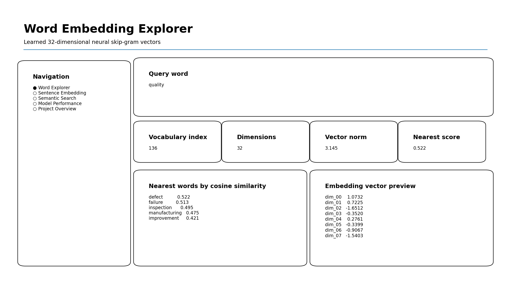
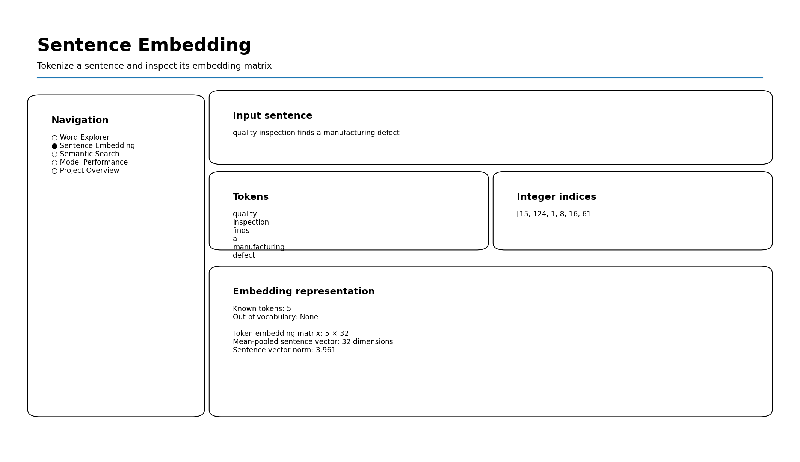
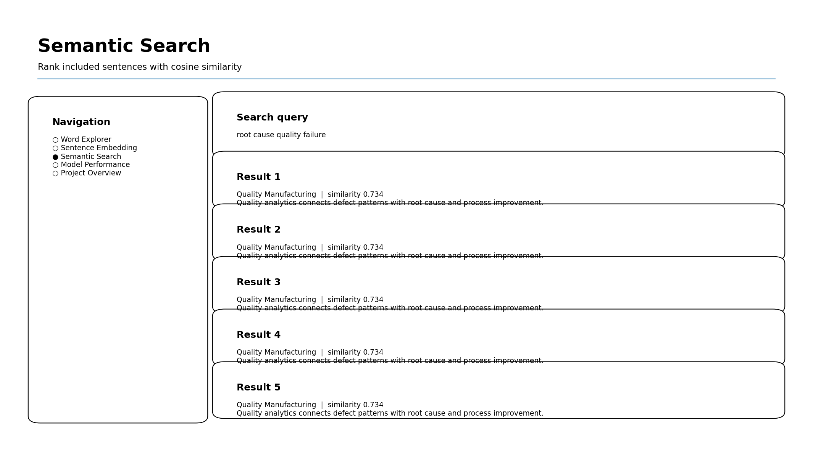
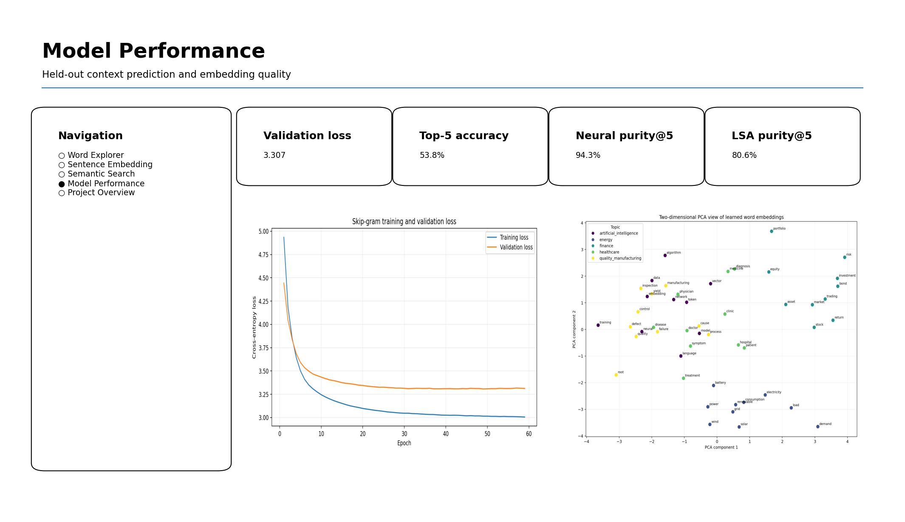

# Word Embedding and NLP Representation Learning

[](https://www.python.org/)
[](https://pytorch.org/)
[](#deployment)
[](../LICENSE)
[](https://github.com/unit-mole/simple-rnn-projects/actions/workflows/word-embedding-rnn-ci.yml)

An end-to-end NLP representation-learning project that converts words into dense learned
vectors with a neural skip-gram model. The project demonstrates deterministic text
preprocessing, vocabulary management, sentence-bounded context-window generation,
PyTorch embedding training, nearest-word analysis, sentence-vector construction,
PCA visualization, semantic search, artifact management, automated testing, and
Streamlit deployment.

**Status:** Portfolio-ready · Deployment pending  
**Live demo:** Add the Streamlit URL after deployment  
**Primary stack:** Python · PyTorch · scikit-learn · pandas · NumPy · Matplotlib · Streamlit

---

## NLP Problem

Raw words cannot be passed directly into a neural network. One-hot vectors assign each
word a separate sparse position, but they do not describe whether two words are related.

This project answers:

> How can words be represented as dense numerical vectors so that a neural model can
> learn contextual similarity and sequence-ready representations from text?

The application produces:

- cleaned text and tokens;
- integer word indices;
- 32-dimensional word vectors;
- nearest words by cosine similarity;
- token-by-embedding matrices;
- mean-pooled sentence vectors;
- two-dimensional PCA visualizations; and
- embedding-based semantic-search results.

---

## Project Highlights

- Neural skip-gram model with a trainable PyTorch `Embedding` layer
- 32-dimensional dense representation for each vocabulary item
- Sentence-bounded context-window generation
- Stable `<PAD>` and `<UNK>` handling
- Held-out validation pairs and early stopping
- TF-IDF + Truncated SVD recreation of the supplied approach as an LSA baseline
- Nearest-word lookup using cosine similarity
- Sentence tokenization, index mapping, and embedding-matrix inspection
- Mean-pooled sentence representations and semantic search
- PCA visualization of selected embedding neighborhoods
- Saved model, vocabulary, embedding matrix, configuration, metadata, and checksums
- Modular Python code, automated tests, GitHub Actions CI, and Streamlit interface

---

## Application Preview

### 1. Word Explorer

Users can select or enter a word, inspect its vocabulary index and vector, compare its
nearest neighbors, download similarity results, and visualize the local neighborhood.



### 2. Sentence Embedding

A sentence is cleaned, tokenized, converted into integer indices, and mapped to a
token-by-embedding matrix. The app also creates a lightweight mean-pooled sentence vector.



### 3. Semantic Search

The application compares a query vector with included sentence vectors and ranks the
closest sentences using cosine similarity.



### 4. Model Performance

The dashboard reports held-out context-prediction metrics, domain purity, the LSA
baseline comparison, training curves, vector norms, and a PCA projection.



---

## Project Status and Honest Scope

This is a complete, deployable educational portfolio prototype. The primary model learns
embeddings from a small **synthetic and privacy-safe** corpus designed around five
domains. It demonstrates representation learning and embedding analysis; it is not a
general-purpose language model or a production semantic-search system.

The supplied project used TF-IDF followed by Truncated SVD to create term and document
vectors. That method is retained as a documented **latent semantic analysis baseline**.
The improved project adds a true neural `Embedding` layer trained through a skip-gram
context-prediction objective.

---

## Dataset

The included corpus contains 1,020 synthetic sentences and
9,306 processed tokens.

| Dataset detail | Value |
|---|---:|
| Corpus sentences | 1,020 |
| Processed tokens | 9,306 |
| Curated domains | 5 |
| Personal or employer data | None |
| External download required by app | No |

The five domains are:

- Artificial Intelligence
- Finance
- Healthcare
- Energy
- Quality and Manufacturing

The corpus was built from the themes already present in the supplied notebook and
expanded into a deterministic educational dataset. See
[`data/README_data.md`](data/README_data.md) for provenance and safety guidance.

The project also provides an optional local loader for selected 20 Newsgroups categories.
That external corpus is not redistributed and is never downloaded by the deployed app.

---

## Text Preprocessing

The pipeline applies:

1. HTML entity decoding and tag removal
2. URL and email removal
3. Lowercasing
4. Alphabetic token extraction
5. Extra-whitespace normalization
6. Minimum-frequency filtering
7. Stable `<PAD>` and `<UNK>` indices
8. Saved word-to-index mapping

Punctuation and casing are removed because this project studies word-level semantic
co-occurrence rather than authorship style or character generation.

---

## Vocabulary and Tokenization

The saved vocabulary contains **171 entries**, including the
special tokens.

```text
<PAD> → 0
<UNK> → 1
frequent corpus words → 2 ... 170
```

A sentence such as:

```text
quality inspection finds a manufacturing defect
```

is transformed into:

```text
cleaned words
        ↓
integer token indices
        ↓
number of tokens × 32 embedding matrix
```

Unknown words map to `<UNK>` so inference does not fail on unseen input.

---

## Word Embedding Approach

### Primary model: neural skip-gram

The primary model predicts nearby context words from a center word.

```text
Center word index
        ↓
Embedding layer: 171 × 32
        ↓
Dense vocabulary projection
        ↓
Context-word probability distribution
```

The model uses:

- PyTorch `nn.Embedding`
- cross-entropy loss
- Adam optimization
- a two-word context window on each side
- held-out center/context validation pairs
- early stopping based on validation loss

The learned embedding matrix has shape:

```text
(171, 32)
```

A 32-dimensional vector is lightweight enough for a small
educational corpus while still allowing visible semantic grouping.

### Baseline: TF-IDF + Truncated SVD

The supplied code created sparse TF-IDF document features and projected them with
Truncated SVD. The resulting term vectors capture latent co-occurrence and are useful,
but they are not trained through a neural context-prediction objective.

The cleaned project keeps this method as a baseline so the portfolio shows both:

- classical latent semantic analysis; and
- neural word-embedding learning.

---

## Representation Comparison

| Representation | Vector type | Semantic relationship | Word order | Role |
|---|---|---|---|---|
| One-hot | Sparse | None | No | Conceptual baseline |
| Bag-of-Words | Sparse | Frequency only | No | Count baseline |
| TF-IDF | Sparse | Weighted document importance | No | Weighted baseline |
| TF-IDF + SVD | Dense | Latent co-occurrence | No | Supplied-project baseline |
| Neural skip-gram | Dense | Learned local context | Context-window based | Primary model |

---

## Evaluation

Embedding quality is assessed quantitatively and qualitatively.

### Saved-model results

| Metric | Result |
|---|---:|
| Validation loss | **3.3070** |
| Validation perplexity | **27.30** |
| Validation top-1 context accuracy | **20.77%** |
| Validation top-5 context accuracy | **53.75%** |
| Neural embedding domain purity@5 | **94.34%** |
| TF-IDF + SVD baseline domain purity@5 | **80.61%** |

### Metric interpretation

- **Validation loss** measures held-out context-word prediction error.
- **Perplexity** is the exponential of validation loss and summarizes context-prediction uncertainty.
- **Top-1 accuracy** checks the highest-scoring predicted context word.
- **Top-5 accuracy** checks whether the real context word appears among the five highest scores.
- **Domain purity@5** measures the percentage of nearest neighbors that share the curated domain of the query word.
- **Nearest-word examples and PCA** provide qualitative evidence of learned grouping.

The curated corpus makes domain purity a useful internal diagnostic. It is not a standard
open-domain benchmark and should not be interpreted as broad language understanding.

---

## Example Learned Relationships

Examples generated from the saved neural embedding matrix include:

```text
model → inference, learning, classification, feature, prediction
market → investor, volatility, bond, security, risk
electricity → renewable, energy, consumption, carbon, grid
quality → defect, failure, inspection, manufacturing, improvement
```

Exact ordering can change after retraining.

---

## Sentence Representation

For each input sentence, the app displays:

- cleaned text;
- token list;
- token indices;
- known and out-of-vocabulary words;
- token embedding-matrix shape;
- vector preview; and
- mean-pooled sentence vector.

Mean pooling provides a simple sentence baseline:

```text
sentence vector = mean of known word vectors
```

It is intentionally transparent, but it loses word order. A Simple RNN would instead
consume the embedding vectors sequentially and maintain a recurrent hidden state.

---

## Why This Project Belongs in the Simple RNN Portfolio

The embedding layer is the representation stage used before a recurrent model processes
token sequences.

```text
Raw text
   ↓
Tokenizer
   ↓
Integer sequence
   ↓
Embedding vectors
   ↓
Simple RNN
   ↓
Task-specific output
```

The IMDb and SMS projects demonstrate complete classification pipelines. This project
isolates the embedding stage so the portfolio explains what the recurrent model receives
as input instead of repeating another classifier.

---

## Streamlit Application

The application contains five sections:

1. **Word Explorer**
   - word lookup;
   - embedding-vector preview;
   - nearest neighbors;
   - downloadable similarities; and
   - local PCA visualization.

2. **Sentence Embedding**
   - cleaning and tokenization;
   - integer indices;
   - OOV handling;
   - token embedding matrix; and
   - downloadable sentence vector.

3. **Semantic Search**
   - sentence-vector query;
   - cosine-similarity ranking; and
   - downloadable results.

4. **Model Performance**
   - validation metrics;
   - baseline comparison;
   - training curves;
   - embedding norms; and
   - PCA output.

5. **Project Overview**
   - model workflow;
   - saved-model information;
   - responsible-use note; and
   - portfolio skills.

The app loads saved artifacts and does not retrain or download data at startup.

---

## Project Structure

```text
simple-rnn-projects/
├── .github/
│   └── workflows/
│       └── word-embedding-rnn-ci.yml
│
└── 06-word-embedding/
    ├── app/
    │   ├── streamlit_app.py
    │   └── requirements.txt
    ├── data/
    │   ├── README_data.md
    │   ├── sample_sentences.txt
    │   ├── sample_text.csv
    │   └── topic_lexicon.json
    ├── images/
    │   ├── 01_word_explorer.png
    │   ├── 02_sentence_embedding.png
    │   ├── 03_semantic_search.png
    │   └── 04_model_performance.png
    ├── models/
    │   ├── word_embedding_model.pt
    │   ├── embedding_matrix.npy
    │   ├── vocabulary.json
    │   ├── model_metadata.json
    │   ├── training_config.json
    │   ├── artifact_checksums.json
    │   └── MODEL_CARD.md
    ├── notebooks/
    │   ├── word_embedding.ipynb
    │   └── archive/
    │       └── word_embedding_original.ipynb
    ├── outputs/
    │   ├── embedding_visualization_2d.png
    │   ├── embedding_projection_2d.csv
    │   ├── embedding_norm_distribution.png
    │   ├── training_curve.png
    │   ├── training_history.csv
    │   ├── model_metrics.json
    │   ├── embedding_matrix_summary.json
    │   ├── word_similarity_examples.csv
    │   ├── semantic_search_examples.csv
    │   ├── sample_sentence_analysis.csv
    │   ├── domain_purity_details.csv
    │   ├── lsa_domain_purity_details.csv
    │   └── representation_comparison.csv
    ├── src/
    │   ├── __init__.py
    │   ├── baseline_representations.py
    │   ├── config.py
    │   ├── data_preprocessing.py
    │   ├── text_preprocessing.py
    │   ├── sequence_generation.py
    │   ├── embedding_training.py
    │   ├── embedding_analysis.py
    │   ├── embedding_pipeline.py
    │   ├── model_evaluation.py
    │   └── visualization.py
    ├── tests/
    │   ├── test_artifact_consistency.py
    │   ├── test_embedding_analysis.py
    │   ├── test_model_loading.py
    │   ├── test_sequence_generation.py
    │   └── test_text_preprocessing.py
    ├── .gitignore
    ├── .python-version
    ├── PROJECT_REVIEW.md
    ├── README.md
    ├── README_HOSTING.md
    ├── VALIDATION_REPORT.json
    ├── requirements.txt
    ├── requirements-ci.txt
    ├── run_app.bat
    ├── train_model.py
    └── validate_project.py
```

The hyphenated lowercase name `06-word-embedding` is used because it matches the existing
numbered repository convention and works cleanly in GitHub and command-line paths.

---

## Run Locally

Use Python 3.12 to match the intended local and deployment environments.

### Windows Command Prompt

Enter the project folder:

```bat
cd /d "C:\Users\atripathi\OneDrive - Veralto\Desktop\AI Codes\GIT Projects\simple-rnn-projects\06-word-embedding"
```

Create the virtual environment in a short path to avoid Windows path-length errors:

```bat
if not exist "C:\venvs" mkdir "C:\venvs"
python -m venv "C:\venvs\wordembed"
call "C:\venvs\wordembed\Scripts\activate.bat"
```

Install dependencies:

```bat
python -m pip install --upgrade pip setuptools wheel
python -m pip install -r requirements.txt
python -m pip install -r requirements-ci.txt
```

Run tests and validation:

```bat
python -m pytest -q
python validate_project.py
```

Launch Streamlit:

```bat
python -m streamlit run app\streamlit_app.py
```

Open the local address displayed by Streamlit, normally:

```text
http://localhost:8501
```

### Future Windows runs

```bat
cd /d "C:\Users\atripathi\OneDrive - Veralto\Desktop\AI Codes\GIT Projects\simple-rnn-projects\06-word-embedding"
call "C:\venvs\wordembed\Scripts\activate.bat"
python -m streamlit run app\streamlit_app.py
```

---

## Optional Retraining

Retraining is not required to run the included application.

To rebuild the saved artifacts from the included corpus:

```bat
python train_model.py
```

A configurable example:

```bat
python train_model.py --embedding-dim 32 --window-size 2 --epochs 60 --batch-size 4096
```

Retraining overwrites the files in `models/` and regenerates the analysis files in
`outputs/`.

The optional 20 Newsgroups loader can be used during custom local experimentation, but
the deployment intentionally uses the included privacy-safe corpus.

---

## Deployment

Deploy with Streamlit Community Cloud using:

```text
Repository:      unit-mole/simple-rnn-projects
Branch:          main
Main file path:  06-word-embedding/app/streamlit_app.py
Python version:  3.12
```

The required dependencies are declared in `app/requirements.txt`.

See [`README_HOSTING.md`](README_HOSTING.md) for deployment, maintenance, and
troubleshooting instructions.

After deployment, replace the pending badge and live-demo text at the top of this README
with the final application URL.

---

## Data and Repository Safety

- The included corpus is synthetic and privacy-safe.
- No employer, customer, health, authentication, or private-message data is included.
- External corpora are not downloaded by the deployed app.
- Local downloaded datasets and secrets are excluded through `.gitignore`.
- Saved model artifacts are required for inference and should remain under `models/`.
- Review licensing and privacy before adding any new corpus.

---

## Responsible Use

This project is for education and portfolio demonstration.

The learned relationships:

- depend on the small curated corpus;
- may be incomplete or misleading;
- may not generalize to new domains;
- should not be treated as dictionary definitions;
- should not be used as fairness evidence; and
- should not support high-impact decisions.

Human review is required before using embedding outputs in any real workflow.

---

## Known Limitations

- Small synthetic vocabulary
- Static, context-independent word vectors
- Out-of-vocabulary words map to a single unknown token
- Mean-pooled sentence vectors lose word order
- PCA compresses high-dimensional distances and can distort neighborhoods
- Domain-purity evaluation is tailored to the curated dataset
- Skip-gram embeddings do not capture polysemy
- Results are not comparable with large pretrained Word2Vec, GloVe, FastText, or transformer embeddings

---

## Future Improvements

- Train on a larger governed public corpus
- Compare with pretrained GloVe or FastText vectors
- Add subword embeddings for rare and unseen words
- Evaluate standard word-similarity datasets where licensing permits
- Add analogy evaluation
- Compare mean pooling with Simple RNN sentence representations
- Add contextual embeddings as a separate transformer project
- Add model-version and drift tracking for a production experiment

---

## Skills Demonstrated

`Natural Language Processing` · `Text Preprocessing` · `Tokenization` ·
`Vocabulary Management` · `Word Embeddings` · `Dense Vector Representations` ·
`Skip-gram` · `PyTorch` · `Embedding Layers` · `Context Windows` ·
`Cosine Similarity` · `PCA` · `Latent Semantic Analysis` · `TF-IDF` ·
`Truncated SVD` · `Semantic Search` · `Artifact Management` · `Model Evaluation` ·
`Testing` · `GitHub Actions` · `CI/CD` · `Streamlit` · `Model Deployment`

---

## Portfolio Description

**One-line description**

> Built a deployment-ready neural word-embedding system that learns dense semantic
> vectors, explores nearest-word relationships, visualizes embedding neighborhoods, and
> performs lightweight sentence search.

**Pinned-repository description**

> NLP representation-learning project featuring deterministic preprocessing,
> vocabulary management, neural skip-gram embeddings, TF-IDF + SVD baseline comparison,
> cosine similarity, PCA visualization, sentence-vector analysis, semantic search,
> testing, CI/CD, and Streamlit deployment.

**Resume bullet**

> Developed a deployable PyTorch word-embedding pipeline with skip-gram training,
> held-out context evaluation, 94.34% curated domain purity@5, semantic-neighbor analysis,
> PCA visualization, saved inference artifacts, automated tests, and a Streamlit interface.

---

## Author

**Anmol Tripathi**  
Quality Data Scientist | Data Science | Machine Learning | Applied AI | Analytics Engineering
